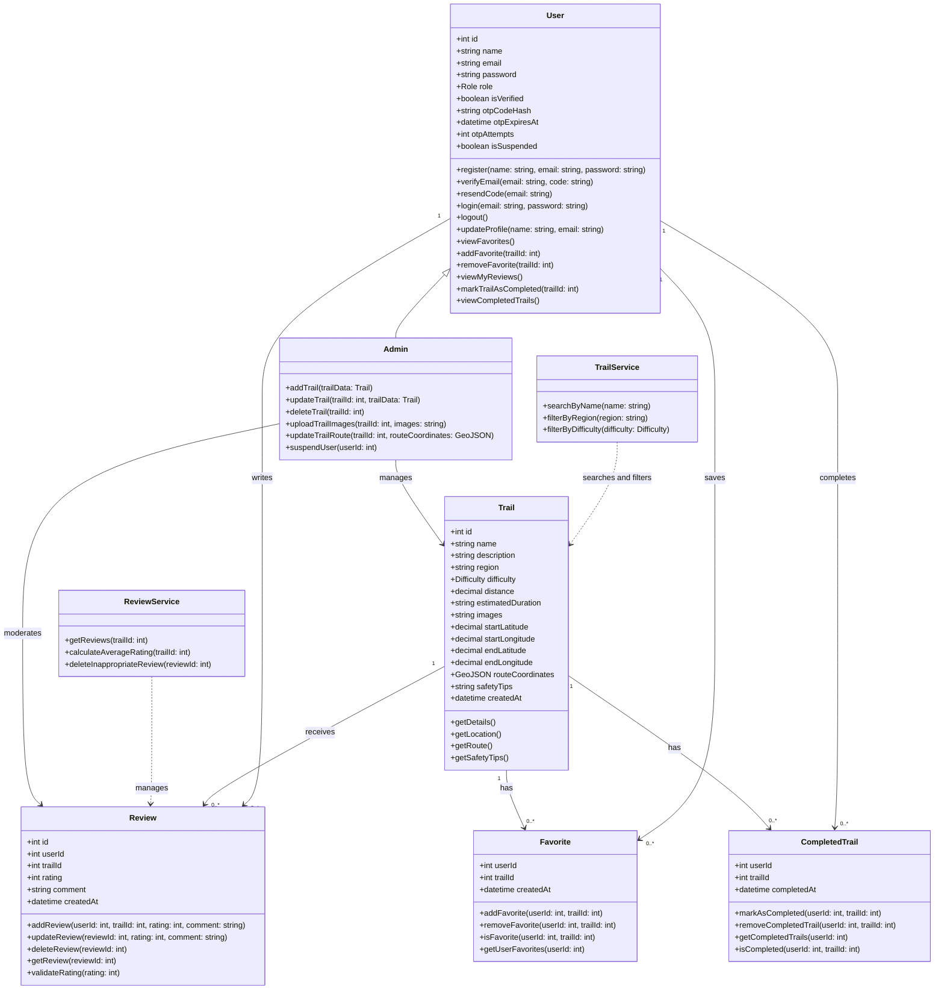
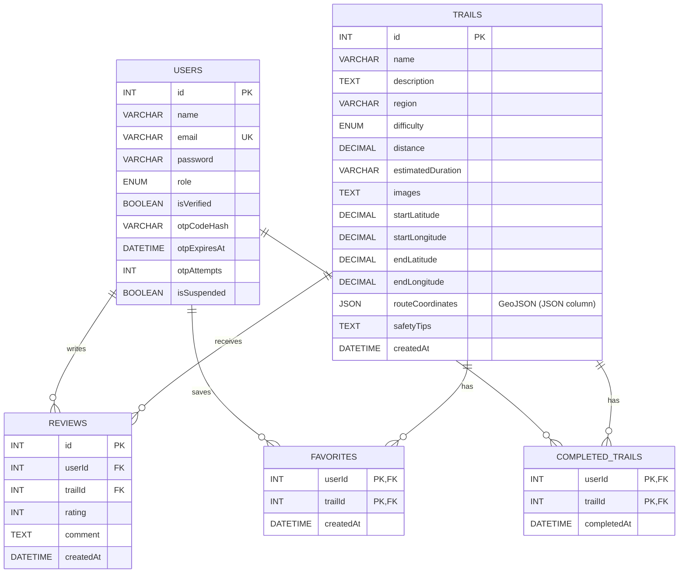

# 1. System Architecture

## Overview

This document defines the high-level system architecture for **Qimmah (قمة)**, a mobile application for discovering officially approved hiking trails across Saudi Arabia.

Qimmah follows a **layered architecture** with three layers — **Presentation**, **Business**, and **Data** — plus external services for maps, images, and email. Each layer has one responsibility and communicates only with the layer directly below it. The system supports three user roles: **Guest**, **Registered User**, and **Admin**.

## Architecture Diagram

> All app data flows through the Flask API. Maps and images load directly in the app. Dashed borders mark external services.

## Layer Descriptions

### 1. Presentation Layer — Flutter (one app)

| Component | Technology | Role |
|---|---|---|
| Hiker screens | Flutter | Browse, search, and filter trails; view trail details and the trail map; read and write reviews; manage favorites and completed trails; edit the profile. Shows a sign-up prompt when a guest tries to save, rate, or review. |
| Admin panel (in-app) | Flutter | Shown only to accounts with the `admin` role. Lets the admin add, edit, and delete trails, upload photos and GeoJSON routes, delete inappropriate reviews, and suspend users. |
| Map | google_maps_flutter | Displays trails, draws each trail's route with its start and end points, and shows the user's current location. |
| Current location | geolocator | Reads the user's location with permission, updated periodically while the app is open. The location never leaves the device. |
| Email verification | pinput | Displays the 6-digit OTP input field during sign-up. |
| Sharing | share_plus | Shares a trail through the device's share menu. |
| Token storage | flutter_secure_storage | Stores the JWT securely on the device. |

### 2. Business Layer — Flask (Python) on Railway

| Component | Technology | Role |
|---|---|---|
| API modules | Flask Blueprints | Receives HTTP requests and returns JSON. Organized into five modules: **Auth**, **Users** (including favorites and completed trails), **Trails**, **Reviews**, and **Admin**. |
| Auth & Security | Flask-JWT-Extended, Werkzeug | Issues JWTs on login (valid for 24 hours), verifies them on protected routes, checks the `admin` role on admin routes, and rejects suspended users on every request. Passwords and OTP codes are hashed with Werkzeug. |
| Business logic | TrailService, ReviewService | Search and filtering, rating validation (1–5), average rating calculation, review ownership checks, OTP verification, and GeoJSON validation. |
| Data access | SQLAlchemy ORM | Maps Python classes (User, Trail, Review, Favorite, CompletedTrail) to MySQL tables and builds safe, parameterized SQL queries. |

### 3. Data Layer — MySQL on Railway

| Component | Technology | Role |
|---|---|---|
| Database | MySQL | Stores users (including email verification data), trails, reviews, favorites, and completed trails. Uses foreign keys for data integrity and utf8mb4 for Arabic text. Each trail's route is stored as GeoJSON in the `routeCoordinates` JSON column. |

### External Services

| Service | Used By | Role |
|---|---|---|
| Google Maps SDK | Flutter app | Map display, trail markers, GeoJSON routes, and the user's current location. |
| Cloudinary | Flask backend | Stores trail photos and delivers them to the app via CDN. |
| Email service (Flask-Mail) | Flask backend | Sends sign-up OTP codes to verify the user's email. |

## Data Flow

Steps describing how data moves through the layers, covering the key use cases in the sequence diagrams (Task 3).

### Use Case 1: User Login

| # | Layer | Step |
|---|---|---|
| 1 | Presentation | The user enters their email and password, and the app sends a login request over HTTPS. |
| 2 | Business | The Auth module gets the user record from MySQL. |
| 3 | Business | The backend verifies the password hash, and checks that the email is verified (`isVerified`) and the account is not suspended (`isSuspended`). |
| 4 | Business | The backend returns a JWT and the user's role. |
| 5 | Presentation | The app stores the token securely and opens Home, showing the admin panel only if the role is `admin`. |

### Use Case 2: Browse, Search, and Filter Trails

| # | Layer | Step |
|---|---|---|
| 1 | Presentation | The user (guest or registered) searches by name or selects a region and difficulty. |
| 2 | Business | The Trails module passes the criteria to TrailService. |
| 3 | Data | MySQL returns the matching trails. |
| 4 | Business | The backend returns a short summary of each trail, with its average rating. |
| 5 | Presentation | The app renders the trail cards, loading photos directly from Cloudinary via CDN. |

### Use Case 3: View Current Location on the Trail Map

| # | Layer | Step |
|---|---|---|
| 1 | Presentation | The user opens a trail, and the app requests its details. |
| 2 | Business → Data | The backend gets the trail's data and GeoJSON route from MySQL and returns them. |
| 3 | Presentation + External | The app draws the route and the start and end points on Google Maps. |
| 4 | Presentation | If the user allows location access, the app reads their location with geolocator and updates it on the map periodically while the app is open. The location is not sent to the server. |

### Use Case 4: Rate and Review a Trail

| # | Layer | Step |
|---|---|---|
| 1 | Presentation | The user taps "Add your review". If the user is a guest, the app prompts them to sign up. |
| 2 | Presentation | The registered user selects a rating (1–5), writes a comment, and the app sends it with the JWT. |
| 3 | Business | The backend verifies the token, and ReviewService validates the rating. |
| 4 | Data | MySQL saves the review. |
| 5 | Business → Presentation | The backend returns the new review, and the app displays it with the updated average rating. |

## Deployment Architecture

| Environment | Description |
|---|---|
| Development | Each developer runs the Flask API and a local MySQL database, and runs the Flutter app on an emulator or device. |
| Staging | A test deployment on Railway with sample trail data, used to test the full system before release. |
| Production | The Flask API and MySQL database are hosted on Railway. The mobile app is distributed as an Android APK / iOS test build. Secret keys (database, JWT, Cloudinary, email) are stored as environment variables on Railway, never in the code. |

## Technical Justifications

| Decision | Justification |
|---|---|
| **Layered architecture** | Each layer has one clear responsibility, so the team can work on layers in parallel, test business logic separately, and change one layer without rewriting the others. |
| **Flutter (one app)** | One codebase builds the Android and iOS app. The admin panel is part of the same app and appears only for admin accounts, so the team builds and maintains a single frontend. Flutter supports right-to-left layouts for an Arabic-first interface. |
| **Flask (Python)** | Builds on the team's Python foundation from the Holberton program. Flask is lightweight and suited to building REST APIs quickly, and Blueprints keep each module independent. |
| **SQLAlchemy** | Lets the team work with Python classes instead of raw SQL, and its parameterized queries protect against SQL injection. |
| **MySQL** | A relational database enforces relationships between users, trails, reviews, favorites, and completed trails (e.g., a review cannot exist without a valid user and trail). MongoDB was considered but not selected, as it does not enforce relational integrity by default. MySQL's JSON column type still stores GeoJSON routes. |
| **GeoJSON** | An open standard for geographic data. Routes recorded with GPS tools can be uploaded as files and drawn on the map without conversion. |
| **JWT** | Stateless authentication with role-based access for Guest, Registered User, and Admin. Tokens expire after 24 hours, and logout removes the token from the device. |
| **Email OTP** | Verifying the email at sign-up confirms the user owns the address and reduces fake accounts. |
| **Google Maps SDK** | Reliable coverage of Saudi Arabia, route lines, and a built-in current-location layer, with an official Flutter package. |
| **geolocator** | Reads the device location on Android and iOS with permission handling. Updating only while the app is open keeps the feature simple and saves battery. |
| **Cloudinary** | Free plan with no credit card required. Photos are not lost when the server redeploys, and they are optimized automatically for mobile. |
| **Railway** | Hosts both the Flask API and MySQL in one place, with simple deployment from GitHub and environment variables for secrets. |

## Non-Functional Requirements Addressed

| Requirement | How the Architecture Addresses It |
|---|---|
| Performance | Flutter compiles to native code for smooth scrolling and map interaction. Trail lists return short summaries, and full GeoJSON routes load only on the details screen. MySQL indexes on region, difficulty, and name speed up search and filtering. Cloudinary CDN reduces image load times. |
| Scalability | The stateless JWT backend allows adding more Flask instances on Railway as usage grows. Location tracking runs on the device, so it adds no load to the server. |
| Security & Privacy | JWTs protect private routes, admin routes check the user's role, and suspended users are rejected on every request. Users can edit or delete only their own reviews. Emails are verified with OTP, passwords and OTP codes are hashed, HTTPS encrypts all communication, and SQLAlchemy prevents SQL injection. The user's location is used only with permission and never leaves the device. |
| Maintainability | Each layer has one responsibility, and Flask Blueprints keep each backend module independent. |
| Usability | Arabic-first, right-to-left interface with simple navigation. Guests can browse all trails without an account, and are prompted to sign up only when they try to save, rate, or review. |
| Battery Efficiency | The location updates periodically and only while the app is open. |

### 2. Business Layer — Flask (Python) on Railway

| Component | Technology | Role |
|---|---|---|
| API modules | Flask Blueprints | Receives HTTP requests and returns JSON. Organized into five modules: **Auth**, **Users** (including favorites and completed trails), **Trails**, **Reviews**, and **Admin**. |
| Auth & Security | Flask-JWT-Extended, Werkzeug | Issues JWTs on login (valid for 24 hours), verifies them on protected routes, checks the `admin` role on admin routes, and rejects suspended users on every request. Passwords are hashed with Werkzeug. |
| Business logic | TrailService, ReviewService | Search and filtering, rating validation (1–5), average rating calculation, review ownership checks, and GeoJSON validation. |
| Data access | SQLAlchemy ORM | Maps Python classes (User, Trail, Review, Favorite, CompletedTrail) to MySQL tables and builds safe, parameterized SQL queries. |

### 3. Data Layer — MySQL on Railway

| Component | Technology | Role |
|---|---|---|
| Database | MySQL | Stores users, trails, reviews, favorites, and completed trails. Uses foreign keys for data integrity and utf8mb4 for Arabic text. Each trail's route is stored as GeoJSON in the `routeCoordinates` JSON column. |

### External Services

| Service | Used By | Role |
|---|---|---|
| Google Maps SDK | Flutter app | Map display, trail markers, GeoJSON routes, and the user's current location. |
| Cloudinary | Flask backend | Stores trail photos and delivers them to the app via CDN. |
| Email service (Flask-Mail) | Flask backend | Sends sign-up OTP codes to verify the user's email. |

## Data Flow

Steps describing how data moves through the layers, covering the key use cases in the sequence diagrams (Task 3).

### Use Case 1: User Login

| # | Layer | Step |
|---|---|---|
| 1 | Presentation | The user enters their email and password, and the app sends a login request over HTTPS. |
| 2 | Business | The Auth module gets the user record from MySQL. |
| 3 | Business | The backend verifies the password hash, and checks that the email is verified and the account is not suspended. |
| 4 | Business | The backend returns a JWT and the user's role. |
| 5 | Presentation | The app stores the token securely and opens Home, showing the admin panel only if the role is `admin`. |

### Use Case 2: Browse, Search, and Filter Trails

| # | Layer | Step |
|---|---|---|
| 1 | Presentation | The user (guest or registered) searches by name or selects a region and difficulty. |
| 2 | Business | The Trails module passes the criteria to TrailService. |
| 3 | Data | MySQL returns the matching trails. |
| 4 | Business | The backend returns a short summary of each trail, with its average rating. |
| 5 | Presentation | The app renders the trail cards, loading photos directly from Cloudinary via CDN. |

### Use Case 3: View Current Location on the Trail Map

| # | Layer | Step |
|---|---|---|
| 1 | Presentation | The user opens a trail, and the app requests its details. |
| 2 | Business → Data | The backend gets the trail's data and GeoJSON route from MySQL and returns them. |
| 3 | Presentation + External | The app draws the route and the start and end points on Google Maps. |
| 4 | Presentation | If the user allows location access, the app reads their location with geolocator and updates it on the map periodically while the app is open. The location is not sent to the server. |

### Use Case 4: Rate and Review a Trail

| # | Layer | Step |
|---|---|---|
| 1 | Presentation | The user taps "Add your review". If the user is a guest, the app prompts them to sign up. |
| 2 | Presentation | The registered user selects a rating (1–5), writes a comment, and the app sends it with the JWT. |
| 3 | Business | The backend verifies the token, and ReviewService validates the rating. |
| 4 | Data | MySQL saves the review. |
| 5 | Business → Presentation | The backend returns the new review, and the app displays it with the updated average rating. |

## Deployment Architecture

| Environment | Description |
|---|---|
| Development | Each developer runs the Flask API and a local MySQL database, and runs the Flutter app on an emulator or device. |
| Staging | A test deployment on Railway with sample trail data, used to test the full system before release. |
| Production | The Flask API and MySQL database are hosted on Railway. The mobile app is distributed as an Android APK / iOS test build. Secret keys (database, JWT, Cloudinary, email) are stored as environment variables on Railway, never in the code. |

## Technical Justifications

| Decision | Justification |
|---|---|
| **Layered architecture** | Each layer has one clear responsibility, so the team can work on layers in parallel, test business logic separately, and change one layer without rewriting the others. |
| **Flutter (one app)** | One codebase builds the Android and iOS app. The admin panel is part of the same app and appears only for admin accounts, so the team builds and maintains a single frontend. Flutter supports right-to-left layouts for an Arabic-first interface. |
| **Flask (Python)** | Builds on the team's Python foundation from the Holberton program. Flask is lightweight and suited to building REST APIs quickly, and Blueprints keep each module independent. |
| **SQLAlchemy** | Lets the team work with Python classes instead of raw SQL, and its parameterized queries protect against SQL injection. |
| **MySQL** | A relational database enforces relationships between users, trails, reviews, favorites, and completed trails (e.g., a review cannot exist without a valid user and trail). MongoDB was considered but not selected, as it does not enforce relational integrity by default. MySQL's JSON column type still stores GeoJSON routes. |
| **GeoJSON** | An open standard for geographic data. Routes recorded with GPS tools can be uploaded as files and drawn on the map without conversion. |
| **JWT** | Stateless authentication with role-based access for Guest, Registered User, and Admin. Tokens expire after 24 hours, and logout removes the token from the device. |
| **Email OTP** | Verifying the email at sign-up confirms the user owns the address and reduces fake accounts. |
| **Google Maps SDK** | Reliable coverage of Saudi Arabia, route lines, and a built-in current-location layer, with an official Flutter package. |
| **geolocator** | Reads the device location on Android and iOS with permission handling. Updating only while the app is open keeps the feature simple and saves battery. |
| **Cloudinary** | Free plan with no credit card required. Photos are not lost when the server redeploys, and they are optimized automatically for mobile. |
| **Railway** | Hosts both the Flask API and MySQL in one place, with simple deployment from GitHub and environment variables for secrets. |

## Non-Functional Requirements Addressed

| Requirement | How the Architecture Addresses It |
|---|---|
| Performance | Flutter compiles to native code for smooth scrolling and map interaction. Trail lists return short summaries, and full GeoJSON routes load only on the details screen. MySQL indexes on region, difficulty, and name speed up search and filtering. Cloudinary CDN reduces image load times. |
| Scalability | The stateless JWT backend allows adding more Flask instances on Railway as usage grows. Location tracking runs on the device, so it adds no load to the server. |
| Security & Privacy | JWTs protect private routes, admin routes check the user's role, and suspended users are rejected on every request. Users can edit or delete only their own reviews. Emails are verified with OTP, passwords and OTP codes are hashed, HTTPS encrypts all communication, and SQLAlchemy prevents SQL injection. The user's location is used only with permission and never leaves the device. |
| Maintainability | Each layer has one responsibility, and Flask Blueprints keep each backend module independent. |
| Usability | Arabic-first, right-to-left interface with simple navigation. Guests can browse all trails without an account, and are prompted to sign up only when they try to save, rate, or review. |
| Battery Efficiency | The location updates periodically and only while the app is open. |

# 2. Components, Classes, and Database Design

## 1. Back-end Classes

### User

**Attributes:**

* `id`
* `name`
* `email`
* `password` (stored as a hash)
* `role`
* `isVerified`
* `otpCodeHash`
* `otpExpiresAt`
* `otpAttempts`
* `isSuspended`

**Methods:**

* `register(name, email, password)`
* `verifyEmail(email, code)`
* `resendCode(email)`
* `login(email, password)`
* `logout()`
* `updateProfile(name, email)`
* `viewFavorites()`
* `addFavorite(trailId)`
* `removeFavorite(trailId)`
* `viewMyReviews()`
* `markTrailAsCompleted(trailId)`
* `viewCompletedTrails()`

### Trail

**Attributes:**

* `id`
* `name`
* `description`
* `region`
* `difficulty`
* `distance`
* `estimatedDuration`
* `images`
* `startLatitude`
* `startLongitude`
* `endLatitude`
* `endLongitude`
* `routeCoordinates` (GeoJSON)
* `safetyTips`
* `createdAt`

**Methods:**

* `getDetails()`
* `getLocation()`
* `getRoute()`
* `getSafetyTips()`

### Review

**Attributes:**

* `id`
* `userId`
* `trailId`
* `rating`
* `comment`
* `createdAt`

**Methods:**

* `addReview(userId, trailId, rating, comment)`
* `updateReview(reviewId, rating, comment)`
* `deleteReview(reviewId)`
* `getReview(reviewId)`
* `validateRating(rating)`

### Favorite

**Attributes:**

* `userId`
* `trailId`
* `createdAt`

**Methods:**

* `addFavorite(userId, trailId)`
* `removeFavorite(userId, trailId)`
* `isFavorite(userId, trailId)`
* `getUserFavorites(userId)`

### CompletedTrail

**Attributes:**

* `userId`
* `trailId`
* `completedAt`

**Methods:**

* `markAsCompleted(userId, trailId)`
* `removeCompletedTrail(userId, trailId)`
* `getCompletedTrails(userId)`
* `isCompleted(userId, trailId)`

### TrailService

**Attributes:**

* None

**Methods:**

* `searchByName(name)`
* `filterByRegion(region)`
* `filterByDifficulty(difficulty)`

### ReviewService

**Attributes:**

* None

**Methods:**

* `getReviews(trailId)`
* `calculateAverageRating(trailId)`
* `deleteInappropriateReview(reviewId)`

### Admin

Admin inherits from the `User` class and provides additional administrative functions.

**Methods:**

* `addTrail(trailData)`
* `updateTrail(trailId, trailData)`
* `deleteTrail(trailId)`
* `uploadTrailImages(trailId, images)`
* `updateTrailRoute(trailId, routeCoordinates)`
* `suspendUser(userId)`

---

## 2. UML Class Diagram

---

## 3. Database Design

The system uses a relational MySQL database (utf8mb4, for Arabic text) with the following tables. Trail routes are stored as GeoJSON in a JSON column.

### Users

| Field        | Type     | Key    |
| ------------ | -------- | ------ |
| id           | INT      | PK     |
| name         | VARCHAR  |        |
| email        | VARCHAR  | UNIQUE |
| password     | VARCHAR  |        |
| role         | ENUM     |        |
| isVerified   | BOOLEAN  |        |
| otpCodeHash  | VARCHAR  |        |
| otpExpiresAt | DATETIME |        |
| otpAttempts  | INT      |        |
| isSuspended  | BOOLEAN  |        |

> `password` and `otpCodeHash` are stored as hashes, never as plain text. `isVerified` starts as `false` and becomes `true` after the user enters the correct OTP code.

### Trails

| Field             | Type                  | Key |
| ----------------- | --------------------- | --- |
| id                | INT                   | PK  |
| name              | VARCHAR               |     |
| description       | TEXT                  |     |
| region            | VARCHAR               |     |
| difficulty        | ENUM                  |     |
| distance          | DECIMAL               |     |
| estimatedDuration | VARCHAR               |     |
| images            | TEXT                  |     |
| startLatitude     | DECIMAL               |     |
| startLongitude    | DECIMAL               |     |
| endLatitude       | DECIMAL               |     |
| endLongitude      | DECIMAL               |     |
| routeCoordinates  | GeoJSON (JSON column) |     |
| safetyTips        | TEXT                  |     |
| createdAt         | DATETIME              |     |

### Reviews

| Field     | Type     | Key            |
| --------- | -------- | -------------- |
| id        | INT      | PK             |
| userId    | INT      | FK → Users.id  |
| trailId   | INT      | FK → Trails.id |
| rating    | INT      |                |
| comment   | TEXT     |                |
| createdAt | DATETIME |                |

### Favorites

| Field     | Type     | Key                |
| --------- | -------- | ------------------ |
| userId    | INT      | PK, FK → Users.id  |
| trailId   | INT      | PK, FK → Trails.id |
| createdAt | DATETIME |                    |

### CompletedTrails

| Field       | Type     | Key                |
| ----------- | -------- | ------------------ |
| userId      | INT      | PK, FK → Users.id  |
| trailId     | INT      | PK, FK → Trails.id |
| completedAt | DATETIME |                    |

> Foreign keys use `ON DELETE CASCADE`, so deleting a trail also deletes its reviews, favorites, and completed entries.

---

## 4. ER Diagram

---

## 5. Front-end Components

The main front-end components are:

* **Home / Trail List**

  * Displays available hiking trails to guests and registered users.
  * Provides access to search and filters.

* **Search Bar**

  * Searches trails by name.

* **Filter Component**

  * Filters trails by region.
  * Filters trails by difficulty.
  * Clears the selected filters.

* **Trail Details**

  * Displays trail description, region, difficulty, distance, duration, images, and safety tips.

* **Trail Map**

  * Displays the trail starting point.
  * Displays the trail route (GeoJSON) with start and end points.
  * Displays the user's current location on the trail map with periodic updates while hiking.

* **Authentication**

  * Registration.
  * Email verification screen with a 6-digit OTP input (`pinput`).
  * Login.
  * Logout.
  * Prompts guests to sign up when they try to save, rate, or review a trail.

* **Profile**

  * Allows registered users to edit their account information.

* **Favorites**

  * Allows registered users to save and remove favorite trails.

* **Reviews & Ratings**

  * Displays reviews and average ratings.
  * Allows registered users to submit ratings and comments.
  * Allows users to edit or delete their own reviews.

* **Completed Trails**

  * Allows registered users to mark trails as completed.
  * Displays the user's list of completed trails.

* **Admin Panel (In-App)**

  * Available inside the same app and shown only to users with the admin role.
  * Allows admins to add, edit, and delete trails.
  * Allows admins to delete inappropriate reviews.
  * Allows admins to suspend users.
