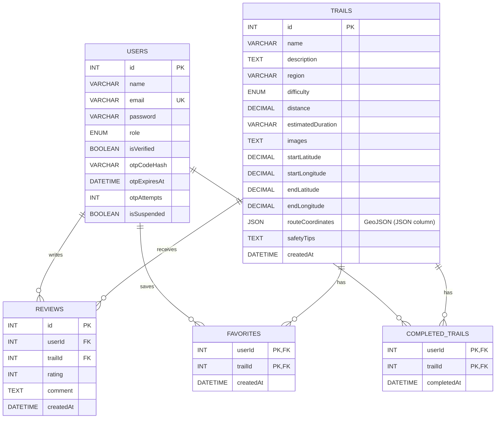

## 0. User Stories

User stories for **Qimmah (قمة)**, a hiking-trails discovery app in Saudi Arabia, prioritized using the **MoSCoW** method.

**User types:**

* **Guest:** browses the app without an account.
* **Registered User:** has an account and can save, rate, and review trails.
* **Admin:** manages trails, reviews, and users.

### [🔴](https://fonts.gstatic.com/s/e/notoemoji/17.0/1f534/72.png) Must Have

| ID    | User Type               | User Story                                                                                                                                                                      |
| ----- | ----------------------- | ------------------------------------------------------------------------------------------------------------------------------------------------------------------------------- |
| US-01 | New User                | As a new user, I want to create an account with my email and password, so that I can save my activity and preferences.                                                          |
| US-02 | Registered User         | As a registered user, I want to log in and log out securely, so that my account stays protected.                                                                                |
| US-03 | Guest                   | As a guest, I want to browse trails without creating an account, so that I can explore the app before signing up.                                                               |
| US-04 | Guest / Registered User | As a guest or registered user, I want to browse a list of hiking trails in Saudi Arabia, so that I can discover new places to hike.                                             |
| US-05 | Guest / Registered User | As a guest or registered user, I want to filter trails by region and difficulty level, so that I can find trails that suit my location and fitness.                             |
| US-06 | Guest / Registered User | As a guest or registered user, I want to view a trail's details (distance, estimated duration, difficulty, description, and photos), so that I can decide if it's right for me. |
| US-07 | Guest / Registered User | As a guest or registered user, I want to see the trail's starting point on a map, so that I can know how to get there.                                                          |

### [🟠](https://fonts.gstatic.com/s/e/notoemoji/17.0/1f7e0/72.png) Should Have

| ID    | User Type               | User Story                                                                                                                                        |
| ----- | ----------------------- | ------------------------------------------------------------------------------------------------------------------------------------------------- |
| US-08 | Guest / Registered User | As a guest or registered user, I want to search for a trail by name, so that I can quickly find a specific trail.                                 |
| US-09 | Guest / Registered User | As a guest or registered user, I want to read other users' reviews, so that I can get real feedback before going.                                 |
| US-10 | Guest                   | As a guest, I want to be prompted to sign up when I try to rate, review, or save a trail, so that I know an account is needed for these features. |
| US-11 | Registered User         | As a registered user, I want to save trails to my favorites, so that I can return to them later.                                                  |
| US-12 | Registered User         | As a registered user, I want to rate and review trails I've visited, so that I can share my experience with others.                               |
| US-13 | Registered User         | As a registered user, I want to edit or delete my own reviews, so that I can correct or remove what I wrote.                                      |
| US-14 | Admin                   | As an admin, I want to add, edit, and delete trails, so that the trail information stays accurate and up to date.                                 |
| US-15 | Admin                   | As an admin, I want to delete inappropriate reviews, so that the content stays respectful and useful.                                             |

### [🟡](https://fonts.gstatic.com/s/e/notoemoji/17.0/1f7e1/72.png) Could Have

| ID    | User Type               | User Story                                                                                                                                                                          |
| ----- | ----------------------- | ----------------------------------------------------------------------------------------------------------------------------------------------------------------------------------- |
| US-16 | Registered User         | As a registered user, I want to mark trails as completed, so that I can track my hiking history.                                                                                    |
| US-17 | Registered User         | As a registered user, I want to edit my account information, so that my profile stays up to date.                                                                                   |
| US-18 | Guest / Registered User | As a guest or registered user, I want to see safety tips for each trail, so that I can prepare properly before hiking.                                                              |
| US-19 | Guest / Registered User | As a guest or registered user, I want to share a trail link with friends, so that we can plan a hike together.                                                                      |
| US-20 | Guest / Registered User | As a guest or registered user, I want to switch the app language between Arabic and English, so that I can use it comfortably.                                                      |
| US-21 | Admin                   | As an admin, I want to suspend users who violate the rules, so that the community stays safe.                                                                                       |
| US-22 | Guest / Registered User | As a guest or registered user, I want to see my current location on the trail map, updated periodically while hiking, so that I can check whether I am following the correct route. |

### [⚪](https://fonts.gstatic.com/s/e/notoemoji/17.0/26aa/72.png) Won't Have (this version)

| ID    | User Type               | User Story                                                                                                                                                               |
| ----- | ----------------------- | ------------------------------------------------------------------------------------------------------------------------------------------------------------------------ |
| US-23 | Guest / Registered User | As a guest or registered user, I want to see live weather conditions for the trail, so that I can plan my hike safely.                                                   |
| US-24 | Guest / Registered User | As a guest or registered user, I want to see an elevation profile of the trail, so that I can understand how steep and demanding it is.                                  |
| US-25 | Guest / Registered User | As a guest or registered user, I want to use offline maps and continuous background GPS tracking during the hike, so that I can navigate even without internet coverage. |

### Summary

| Priority    | Count  |
| ----------- | ------ |
| Must Have   | 7      |
| Should Have | 8      |
| Could Have  | 7      |
| Won't Have  | 3      |
| **Total**   | **25** |


# 1. System Architecture

## Overview

This document defines the high-level system architecture for **Qimmah (قمة)**, a mobile application for discovering officially approved hiking trails across Saudi Arabia.

The architecture follows a **layered model** — Presentation (Flutter), Business (Flask API), and Data (MySQL) — with integration to external third-party services for maps, image hosting, and email. The system supports three user roles: **Guest**, **Registered User**, and **Admin**.

## Architecture Diagram


> All app data flows through the Flask API. Maps and images load directly in the app. Dashed borders mark external services.

## Component Descriptions

| Component | Technology | Role |
|---|---|---|
| Frontend | Flutter (one app) | Renders the user interface in Arabic and English. Handles all hiker interactions: browsing, searching, filtering, trail details, the trail map, reviews, favorites, completed trails, and the profile. Shows a sign-up prompt when a guest tries to save, rate, or review. Communicates with the backend via REST API calls. |
| Admin Panel | Flutter (in-app) | Part of the same app, shown only to accounts with the `admin` role. Lets the admin add, edit, and delete trails, upload photos and GeoJSON routes, delete inappropriate reviews, and suspend users. |
| Backend | Flask (Python) on Railway | Processes all business logic: authentication, email verification, data validation, search and filtering, rating calculation, and communication between the frontend and the database. Exposes RESTful API endpoints organized into Flask Blueprints: Auth, Users, Trails, Reviews, and Admin. |
| ORM | SQLAlchemy | Maps Python classes (User, Trail, Review, Favorite, CompletedTrail) to MySQL tables and builds safe, parameterized SQL queries. |
| Database | MySQL on Railway | Stores all application data: users (including email verification data), trails, reviews, favorites, and completed trails. Uses relational tables with foreign key constraints to enforce data integrity, and utf8mb4 for Arabic text. Each trail's route is stored as GeoJSON in the `routeCoordinates` JSON column. |
| Auth Layer | JWT (Flask-JWT-Extended) | Manages stateless authentication. Issues tokens on login (valid for 24 hours) and verifies identity on protected routes. Supports 3 roles: Guest, Registered User, and Admin. Rejects suspended users on every request. Passwords and OTP codes are hashed with Werkzeug. |
| Email Verification | Flask-Mail (backend) + pinput (app) | The backend emails a 6-digit OTP code during sign-up, and the app displays the code input field with `pinput`. The account is activated after the correct code is entered. |
| Image Storage | Cloudinary | Stores and serves trail photos. Provides CDN delivery and automatic optimization. |
| Map Service | Google Maps SDK (google_maps_flutter) | Displays trails on the map, draws each trail's route with its start and end points, and shows the user's current location. |
| Device Location | geolocator | Reads the user's current location with permission, updated periodically while the app is open. The location stays on the device and is never sent to the server. |
| Language Switch | flutter_localizations | Switches the app interface between Arabic (right-to-left) and English. |
| Sharing | share_plus | Shares a trail through the device's share menu. |

## Data Flow

Steps describing how data moves through the system, covering the four key use cases defined in the sequence diagrams (Task 3):

### Use Case 1: User Login

| # | Step |
|---|---|
| 1 | The user enters their email and password on the Frontend (Flutter). |
| 2 | The frontend sends a login request to the Backend (Flask) over HTTPS. |
| 3 | The backend checks the user's credentials against MySQL. |
| 4 | MySQL returns the matching user record (password hash, role, `isVerified`, `isSuspended`) to the backend. |
| 5 | The backend verifies the password, and checks that the email is verified and the account is not suspended. |
| 6 | The backend returns an authentication response (JWT token and role) to the frontend. |
| 7 | The frontend stores the token securely and displays the home screen (with the admin panel if the role is `admin`), or an error message. If the email is not verified, it opens the verification screen, where the user enters the code with `pinput`. |

### Use Case 2: Browse, Search, and Filter Trails

| # | Step |
|---|---|
| 1 | The user (guest or registered) searches by name or selects a region and difficulty on the Frontend. |
| 2 | The frontend requests the matching trails from the Backend. |
| 3 | The backend queries MySQL for trails matching the search or filters. |
| 4 | MySQL returns the matching trails to the backend. |
| 5 | The backend sends a short summary of each trail, with its average rating, to the frontend as a JSON response. |
| 6 | The frontend renders the list of trails for the user. |
| 7 | Trail photos are fetched directly from Cloudinary via CDN URLs. |

### Use Case 3: View Trail Details and Current Location on the Map

| # | Step |
|---|---|
| 1 | The user taps a trail on the Frontend. |
| 2 | The frontend requests the trail's details from the Backend. |
| 3 | The backend queries MySQL for the trail's data and GeoJSON route. |
| 4 | The backend returns the trail details, route, start and end points, and safety tips to the frontend. |
| 5 | The frontend passes the route to Google Maps SDK, which draws it on the map with the start and end points. |
| 6 | If the user allows location access, the frontend reads their location with geolocator and updates it on the map periodically while the app is open. The location is not sent to the backend. |

### Use Case 4: Rate and Review a Trail

| # | Step |
|---|---|
| 1 | The user taps "Add your review" on the Frontend. If the user is a guest, the frontend prompts them to sign up. |
| 2 | The registered user selects a rating (1–5), writes a comment, and the frontend sends it to the Backend with the JWT. |
| 3 | The backend verifies the token and validates the rating and comment. |
| 4 | The backend saves the review in MySQL and calculates the trail's new average rating. |
| 5 | The backend returns the new review to the frontend, which displays it with the updated average rating. |

## Deployment Architecture

| Environment | Description |
|---|---|
| Development | Local machines — each developer runs the Flask API and MySQL locally, and runs the Flutter app on an emulator or device. |
| Staging | Pre-production environment on Railway with sample trail data, used for testing before release. |
| Production | The Flask API and MySQL database are deployed on Railway. The mobile app is distributed as an Android APK / iOS test build. Secret keys (database, JWT, Cloudinary, email) are stored as environment variables on Railway, never in the code. |

## Technical Justifications

Every technology in this architecture was chosen based on the team's functional requirements, non-functional requirements, and project constraints.

| Technology | Decision | Justification |
|---|---|---|
| Layered Architecture | Architecture Style | Each layer (Presentation, Business, Data) has one clear responsibility and communicates only with the layer below it. The team can work on layers in parallel, test business logic separately, and change one layer without rewriting the others. |
| Flutter | Frontend Framework | One codebase builds the Android and iOS app, which suits a small student team. The admin panel is part of the same app, so the team builds and maintains a single frontend. Flutter supports right-to-left (Arabic) and left-to-right (English) layouts, with official packages for Google Maps and localization. |
| Flask (Python) | Backend Framework | Builds on the team's Python foundation from the Holberton program. Flask is lightweight and well-suited for building RESTful APIs quickly, and Blueprints keep each module independent. |
| SQLAlchemy | ORM | Lets the team work with Python classes instead of raw SQL, and its parameterized queries protect against SQL injection. |
| MySQL | Database | A relational database was chosen over a non-relational one for Qimmah's core data model.<br><br>MySQL (relational — interconnected tables) enforces strong relationships between users, trails, reviews, favorites, and completed trails, and guarantees data integrity (e.g., a review cannot exist without a valid user and trail). Foreign key constraints prevent orphaned or invalid records.<br><br>MongoDB (non-relational — JSON documents) was considered but not selected, as it does not enforce relational integrity by default. MySQL's JSON column type still stores GeoJSON routes. |
| GeoJSON | Route Data Format | An open standard for geographic data. Routes recorded with GPS tools can be uploaded as files and drawn on the map without conversion. |
| JWT | Authentication | Stateless authentication eliminates the need for session management on the server. JWT tokens support role-based access control for 3 user types: Guest, Registered User, and Admin. Tokens expire after 24 hours, and logout removes the token from the device. |
| Email OTP (Flask-Mail + pinput) | Email Verification | Verifying the email at sign-up confirms the user owns the address and reduces fake accounts. `pinput` provides a clear 6-digit code input in the app. |
| Google Maps SDK | Map Service | Provides reliable map coverage of Saudi Arabia, route lines, and a built-in current-location layer, with an official Flutter package. |
| geolocator | Device Location | Reads the device location on Android and iOS with permission handling. Updating only while the app is open keeps the feature simple and saves battery. |
| Cloudinary | Image Hosting | Provides a free-tier CDN for image storage and delivery, with no credit card required. Photos are not lost when the server redeploys, and they are optimized automatically for mobile. |
| Railway | Hosting | Hosts both the Flask API and MySQL in one place, with simple deployment from GitHub and environment variables for secrets. |

## Non-Functional Requirements Addressed

| Requirement | How the Architecture Addresses It |
|---|---|
| Performance | Flutter compiles to native code for smooth scrolling and map interaction. Trail lists return short summaries, and full GeoJSON routes load only on the details screen. MySQL indexes on region, difficulty, and name speed up search and filtering. Cloudinary CDN reduces image load times. |
| Scalability | MySQL supports indexing and read replicas. The stateless JWT backend allows adding more Flask instances on Railway as usage grows. Location tracking runs on the device, so it adds no load to the server. |
| Security & Privacy | JWT ensures only authenticated users access protected routes, admin routes check the user's role, and suspended users are rejected on every request. Users can edit or delete only their own reviews. Emails are verified with OTP. HTTPS encrypts all client-server communication. Passwords and OTP codes are hashed using Werkzeug, and SQLAlchemy prevents SQL injection. The user's location is used only with permission and never leaves the device. |
| Maintainability | Separation of concerns: the presentation, business, and data layers are fully decoupled, and each layer can be updated independently. Flask Blueprints keep each backend module independent. |
| Usability | Arabic-first, right-to-left interface with simple navigation and an option to switch to English. Guests can browse all trails without an account, and are prompted to sign up only when they try to save, rate, or review. |
| Battery Efficiency | The location updates periodically and only while the app is open. |


# 2. Components, Classes, and Database Design

## 1. Back-end Classes

### User

**Attributes:**

* `id`
* `name`
* `email`
* `password` (stored as a hash)
* `role`
* `isVerified`
* `otpCodeHash`
* `otpExpiresAt`
* `otpAttempts`
* `isSuspended`

**Methods:**

* `register(name, email, password)`
* `verifyEmail(email, code)`
* `resendCode(email)`
* `login(email, password)`
* `logout()`
* `updateProfile(name, email)`
* `viewFavorites()`
* `addFavorite(trailId)`
* `removeFavorite(trailId)`
* `viewMyReviews()`
* `markTrailAsCompleted(trailId)`
* `viewCompletedTrails()`

### Trail

**Attributes:**

* `id`
* `name`
* `description`
* `region`
* `difficulty`
* `distance`
* `estimatedDuration`
* `images`
* `startLatitude`
* `startLongitude`
* `endLatitude`
* `endLongitude`
* `routeCoordinates` (GeoJSON)
* `safetyTips`
* `createdAt`

**Methods:**

* `getDetails()`
* `getLocation()`
* `getRoute()`
* `getSafetyTips()`

### Review

**Attributes:**

* `id`
* `userId`
* `trailId`
* `rating`
* `comment`
* `createdAt`

**Methods:**

* `addReview(userId, trailId, rating, comment)`
* `updateReview(reviewId, rating, comment)`
* `deleteReview(reviewId)`
* `getReview(reviewId)`
* `validateRating(rating)`

### Favorite

**Attributes:**

* `userId`
* `trailId`
* `createdAt`

**Methods:**

* `addFavorite(userId, trailId)`
* `removeFavorite(userId, trailId)`
* `isFavorite(userId, trailId)`
* `getUserFavorites(userId)`

### CompletedTrail

**Attributes:**

* `userId`
* `trailId`
* `completedAt`

**Methods:**

* `markAsCompleted(userId, trailId)`
* `removeCompletedTrail(userId, trailId)`
* `getCompletedTrails(userId)`
* `isCompleted(userId, trailId)`

### TrailService

**Attributes:**

* None

**Methods:**

* `searchByName(name)`
* `filterByRegion(region)`
* `filterByDifficulty(difficulty)`

### ReviewService

**Attributes:**

* None

**Methods:**

* `getReviews(trailId)`
* `calculateAverageRating(trailId)`
* `deleteInappropriateReview(reviewId)`

### Admin

Admin inherits from the `User` class and provides additional administrative functions.

**Methods:**

* `addTrail(trailData)`
* `updateTrail(trailId, trailData)`
* `deleteTrail(trailId)`
* `uploadTrailImages(trailId, images)`
* `updateTrailRoute(trailId, routeCoordinates)`
* `suspendUser(userId)`

---

## 2. UML Class Diagram


---

## 3. Database Design

The system uses a relational MySQL database (utf8mb4, for Arabic text) with the following tables. Trail routes are stored as GeoJSON in a JSON column.

### Users

| Field        | Type     | Key    |
| ------------ | -------- | ------ |
| id           | INT      | PK     |
| name         | VARCHAR  |        |
| email        | VARCHAR  | UNIQUE |
| password     | VARCHAR  |        |
| role         | ENUM     |        |
| isVerified   | BOOLEAN  |        |
| otpCodeHash  | VARCHAR  |        |
| otpExpiresAt | DATETIME |        |
| otpAttempts  | INT      |        |
| isSuspended  | BOOLEAN  |        |

> `password` and `otpCodeHash` are stored as hashes, never as plain text. `isVerified` starts as `false` and becomes `true` after the user enters the correct OTP code.

### Trails

| Field             | Type                  | Key |
| ----------------- | --------------------- | --- |
| id                | INT                   | PK  |
| name              | VARCHAR               |     |
| description       | TEXT                  |     |
| region            | VARCHAR               |     |
| difficulty        | ENUM                  |     |
| distance          | DECIMAL               |     |
| estimatedDuration | VARCHAR               |     |
| images            | TEXT                  |     |
| startLatitude     | DECIMAL               |     |
| startLongitude    | DECIMAL               |     |
| endLatitude       | DECIMAL               |     |
| endLongitude      | DECIMAL               |     |
| routeCoordinates  | GeoJSON (JSON column) |     |
| safetyTips        | TEXT                  |     |
| createdAt         | DATETIME              |     |

### Reviews

| Field     | Type     | Key            |
| --------- | -------- | -------------- |
| id        | INT      | PK             |
| userId    | INT      | FK → Users.id  |
| trailId   | INT      | FK → Trails.id |
| rating    | INT      |                |
| comment   | TEXT     |                |
| createdAt | DATETIME |                |

### Favorites

| Field     | Type     | Key                |
| --------- | -------- | ------------------ |
| userId    | INT      | PK, FK → Users.id  |
| trailId   | INT      | PK, FK → Trails.id |
| createdAt | DATETIME |                    |

### CompletedTrails

| Field       | Type     | Key                |
| ----------- | -------- | ------------------ |
| userId      | INT      | PK, FK → Users.id  |
| trailId     | INT      | PK, FK → Trails.id |
| completedAt | DATETIME |                    |

> Foreign keys use `ON DELETE CASCADE`, so deleting a trail also deletes its reviews, favorites, and completed entries.

---

## 4. ER Diagram



---

## 5. Front-end Components

The main front-end components are:

* **Home / Trail List**

  * Displays available hiking trails to guests and registered users.
  * Provides access to search and filters.

* **Search Bar**

  * Searches trails by name.

* **Filter Component**

  * Filters trails by region.
  * Filters trails by difficulty.
  * Clears the selected filters.

* **Trail Details**

  * Displays trail description, region, difficulty, distance, duration, images, and safety tips.

* **Trail Map**

  * Displays the trail starting point.
  * Displays the trail route (GeoJSON) with start and end points.
  * Displays the user's current location on the trail map with periodic updates while hiking.

* **Authentication**

  * Registration.
  * Email verification screen with a 6-digit OTP input (`pinput`).
  * Login.
  * Logout.
  * Prompts guests to sign up when they try to save, rate, or review a trail.

* **Profile**

  * Allows registered users to edit their account information.

* **Favorites**

  * Allows registered users to save and remove favorite trails.

* **Reviews & Ratings**

  * Displays reviews and average ratings.
  * Allows registered users to submit ratings and comments.
  * Allows users to edit or delete their own reviews.

* **Completed Trails**

  * Allows registered users to mark trails as completed.
  * Displays the user's list of completed trails.

* **Language Switch**

  * Allows users to switch the app interface between Arabic and English.

* **Admin Panel (In-App)**

  * Available inside the same app and shown only to users with the admin role.
  * Allows admins to add, edit, and delete trails.
  * Allows admins to delete inappropriate reviews.
  * Allows admins to suspend users.
 


# 4. API Specifications

## External APIs

| API | Used By | Purpose | Why It Was Chosen |
|---|---|---|---|
| Google Maps SDK for Android / iOS (via `google_maps_flutter`) | Flutter app (hiker screens and admin panel) | Displays trails on the map, draws each trail's GeoJSON route with its start and end points, and shows the user's current location (My Location layer). | Reliable map coverage of Saudi Arabia, custom markers, route lines, and a built-in current-location layer. Has an official Flutter package, and its monthly free usage covers the MVP. |
| Cloudinary Upload API (via `cloudinary` Python SDK) | Flask backend | Uploads trail photos and returns their URLs. Photos are served to the app via Cloudinary's CDN. | Free plan with no credit card required. Images are not lost when the server redeploys. Automatic resizing and CDN delivery make photos load fast on mobile. |
| Email Service (SMTP via `Flask-Mail`) | Flask backend | Sends a one-time verification code (OTP) to the user's email during sign-up. | Confirms that each account uses a real email address the user owns, which reduces fake accounts. Flask-Mail integrates directly with Flask and works with standard SMTP email providers. |

> **Device and app packages (not external APIs):**
> - `geolocator` reads the user's current location on the device, only with permission and only while the app is open. It is never sent to the server.
> - `pinput` displays the 6-digit OTP input field on the email verification screen.
>
> **Data format:** trail routes are stored as **GeoJSON** in the `routeCoordinates` JSON column. Each route is a `FeatureCollection` with the trail path as a `LineString`. Coordinates follow the GeoJSON order `[longitude, latitude]`.
>
> **API keys** are never shared publicly: the Google Maps key is restricted to Qimmah's app, and Cloudinary and email credentials are stored only on the server as environment variables.

## Internal API (Flask REST API)

### General Rules

- **Base URL:** `https://<qimmah-backend>.up.railway.app/api` (hosted on Railway)
- **Format:** All requests and responses use JSON, except trail creation and image uploads, which use `multipart/form-data` (to send files).
- **Authentication:** Protected endpoints require a JWT in the header: `Authorization: Bearer <token>`. Tokens expire after 24 hours.
- **Access levels:** 🌐 Guest (no account) · 🔒 Registered user · 🛠️ Admin only
- **Admin access:** the admin uses the same Flutter app; admin screens appear only for accounts with the `admin` role, and every 🛠️ endpoint checks this role on the server.
- **Common errors:** every 🔒 and 🛠️ endpoint returns `401` if the token is missing or expired, `403` if the account is suspended, and every 🛠️ endpoint returns `403` if the user is not an admin.
- **Error format:** `{ "error": "Error message" }`

### Endpoints Overview

| # | Module | Method | URL Path | Access | Class Method (Task 2) | User Story |
|---|---|---|---|---|---|---|
| 1 | Auth | POST | `/api/auth/register` | 🌐 | `User.register()` | 1 |
| 2 | Auth | POST | `/api/auth/verify-email` | 🌐 | `User.verifyEmail()` | 1 |
| 3 | Auth | POST | `/api/auth/resend-code` | 🌐 | `User.resendCode()` | 1 |
| 4 | Auth | POST | `/api/auth/login` | 🌐 | `User.login()` | 2 |
| 5 | Users | GET | `/api/users/me` | 🔒 | User attributes | 17 |
| 6 | Users | PUT | `/api/users/me` | 🔒 | `User.updateProfile()` | 17 |
| 7 | Users | GET | `/api/users/me/reviews` | 🔒 | `User.viewMyReviews()` | 13 |
| 8 | Users | GET | `/api/users/me/favorites` | 🔒 | `User.viewFavorites()` | 11 |
| 9 | Users | POST | `/api/users/me/favorites` | 🔒 | `User.addFavorite()` | 11 |
| 10 | Users | DELETE | `/api/users/me/favorites/{trail_id}` | 🔒 | `User.removeFavorite()` | 11 |
| 11 | Users | GET | `/api/users/me/completed-trails` | 🔒 | `User.viewCompletedTrails()` | 16 |
| 12 | Users | POST | `/api/users/me/completed-trails` | 🔒 | `User.markTrailAsCompleted()` | 16 |
| 13 | Users | DELETE | `/api/users/me/completed-trails/{trail_id}` | 🔒 | `CompletedTrail.removeCompletedTrail()` | 16 |
| 14 | Trails | GET | `/api/trails` | 🌐 | `TrailService.searchByName()` · `filterByRegion()` · `filterByDifficulty()` | 3, 4, 5, 8 |
| 15 | Trails | GET | `/api/trails/{id}` | 🌐 | `Trail.getDetails()` · `getRoute()` · `getSafetyTips()` | 6, 7, 18, 22 |
| 16 | Reviews | GET | `/api/trails/{id}/reviews` | 🌐 | `ReviewService.getReviews()` · `calculateAverageRating()` | 9 |
| 17 | Reviews | POST | `/api/trails/{id}/reviews` | 🔒 | `Review.addReview()` · `validateRating()` | 12 |
| 18 | Reviews | PUT | `/api/reviews/{id}` | 🔒 | `Review.updateReview()` | 13 |
| 19 | Reviews | DELETE | `/api/reviews/{id}` | 🔒 | `Review.deleteReview()` | 13 |
| 20 | Admin | POST | `/api/admin/trails` | 🛠️ | `Admin.addTrail()` | 14 |
| 21 | Admin | PUT | `/api/admin/trails/{id}` | 🛠️ | `Admin.updateTrail()` | 14 |
| 22 | Admin | DELETE | `/api/admin/trails/{id}` | 🛠️ | `Admin.deleteTrail()` | 14 |
| 23 | Admin | POST | `/api/admin/trails/{id}/images` | 🛠️ | `Admin.uploadTrailImages()` | 14 |
| 24 | Admin | PUT | `/api/admin/trails/{id}/route` | 🛠️ | `Admin.updateTrailRoute()` | 14 |
| 25 | Admin | DELETE | `/api/admin/reviews/{id}` | 🛠️ | `ReviewService.deleteInappropriateReview()` | 15 |
| 26 | Admin | PATCH | `/api/admin/users/{id}/suspend` | 🛠️ | `Admin.suspendUser()` | 21 |

> **Handled in the app, not the API:**
> - **Story 2 (log out) — `User.logout()`:** the app deletes the JWT from secure storage, and the token also expires on its own after 24 hours.
> - **Story 10 (guest sign-up prompt):** the app shows the prompt when a guest tries an action that needs a 🔒 endpoint.
> - **Story 19 (share a trail):** the app shares the trail's details through the device's share menu (`share_plus`).
> - **Story 20 (switch language):** the app switches its interface between Arabic and English with Flutter localization (`flutter_localizations`).
> - **Story 22 (current location):** the app reads the location on the device and draws it on the map over the route from endpoint 15.

---

### Auth Module

#### 1. POST `/api/auth/register` 🌐

**Input (JSON):**
```json
{
  "name": "Sara",
  "email": "sara@example.com",
  "password": "StrongPass123"
}
```

**Output — 201 Created:**
```json
{
  "message": "Verification code sent to your email",
  "email": "sara@example.com"
}
```

> The account is created with `isVerified = false`. A 6-digit code is emailed to the user, stored as a hash in `otpCodeHash`, and expires after 10 minutes (`otpExpiresAt`). No token is returned until the email is verified.

**Errors:** `400` missing or invalid fields · `409` email already registered

#### 2. POST `/api/auth/verify-email` 🌐

**Input (JSON):** the code the user enters in the `pinput` field.
```json
{
  "email": "sara@example.com",
  "code": "482915"
}
```

**Output — 200 OK:**
```json
{
  "token": "eyJhbGciOiJIUzI1NiIs...",
  "user": { "id": 12, "name": "Sara", "email": "sara@example.com", "role": "user" }
}
```

> On success, `isVerified` becomes `true`. Each wrong code increases `otpAttempts`; after 5 wrong attempts, the user must request a new code.

**Errors:** `400` wrong or expired code · `404` account not found · `429` too many wrong attempts

#### 3. POST `/api/auth/resend-code` 🌐

**Input (JSON):**
```json
{ "email": "sara@example.com" }
```

**Output — 200 OK:**
```json
{ "message": "A new verification code has been sent" }
```

> A new code replaces the old one and resets `otpAttempts`. Requests are limited to once per minute.

**Errors:** `404` account not found · `409` email already verified · `429` requested too soon

#### 4. POST `/api/auth/login` 🌐

**Input (JSON):**
```json
{
  "email": "sara@example.com",
  "password": "StrongPass123"
}
```

**Output — 200 OK:**
```json
{
  "token": "eyJhbGciOiJIUzI1NiIs...",
  "user": { "id": 12, "name": "Sara", "email": "sara@example.com", "role": "user" }
}
```

> The `role` field tells the app whether to show the admin panel.

**Errors:** `401` invalid email or password · `403` email not verified (`isVerified`), or account suspended (`isSuspended`)

---

### Users Module

#### 5. GET `/api/users/me` 🔒

**Output — 200 OK:**
```json
{
  "id": 12,
  "name": "Sara",
  "email": "sara@example.com",
  "role": "user"
}
```

#### 6. PUT `/api/users/me` 🔒

**Input (JSON):** only the fields being changed.
```json
{
  "name": "Sara A.",
  "email": "sara.a@example.com"
}
```

**Output — 200 OK:** The updated user object.

> If the email is changed, `isVerified` becomes `false` and a new verification code is sent to the new email. The user verifies it with endpoint 2.

**Errors:** `400` invalid fields · `409` email already used

#### 7. GET `/api/users/me/reviews` 🔒

**Output — 200 OK:**
```json
{
  "reviews": [
    {
      "id": 31,
      "trail": { "id": 7, "name": "مسار جبل السودة" },
      "rating": 5,
      "comment": "مسار رائع وإطلالات جميلة",
      "created_at": "2026-10-01T09:30:00Z"
    }
  ]
}
```

#### 8. GET `/api/users/me/favorites` 🔒

**Output — 200 OK:** a list of favorite trails in the same summary structure as endpoint 14.

#### 9. POST `/api/users/me/favorites` 🔒

**Input (JSON):**
```json
{ "trail_id": 7 }
```

**Output — 201 Created:**
```json
{ "message": "Trail added to favorites", "trail_id": 7, "created_at": "2026-10-01T12:00:00Z" }
```

**Errors:** `404` trail not found · `409` already in favorites

#### 10. DELETE `/api/users/me/favorites/{trail_id}` 🔒

**Output — 204 No Content**

**Errors:** `404` trail not in favorites

#### 11. GET `/api/users/me/completed-trails` 🔒

**Output — 200 OK:** a list of trails in the same summary structure as endpoint 14, each with a `completed_at` date.

#### 12. POST `/api/users/me/completed-trails` 🔒

**Input (JSON):**
```json
{ "trail_id": 7 }
```

**Output — 201 Created:**
```json
{ "message": "Trail marked as completed", "trail_id": 7, "completed_at": "2026-10-01T15:00:00Z" }
```

**Errors:** `404` trail not found · `409` already marked as completed

#### 13. DELETE `/api/users/me/completed-trails/{trail_id}` 🔒

**Output — 204 No Content**

**Errors:** `404` trail not in completed list

---

### Trails Module

#### 14. GET `/api/trails` 🌐

**Input (query parameters, all optional):**

| Parameter | Type | Example | Class Method |
|---|---|---|---|
| `search` | string | `السودة` | `TrailService.searchByName()` |
| `region` | string | `asir` | `TrailService.filterByRegion()` |
| `difficulty` | string | `easy` · `moderate` · `hard` | `TrailService.filterByDifficulty()` |
| `page` | integer | `1` | — |
| `limit` | integer | `20` | — |

**Example:** `GET /api/trails?region=asir&difficulty=moderate`

**Output — 200 OK** (short summary only, no full route):
```json
{
  "trails": [
    {
      "id": 7,
      "name": "مسار جبل السودة",
      "region": "asir",
      "difficulty": "moderate",
      "distance": 8,
      "estimated_duration": "3–4 ساعات",
      "average_rating": 4.8,
      "cover_image": "https://res.cloudinary.com/.../soudah.jpg",
      "start_point": { "lat": 18.2721, "lng": 42.3684 }
    }
  ],
  "page": 1,
  "total": 1
}
```

> `average_rating` is calculated with `ReviewService.calculateAverageRating()`.

#### 15. GET `/api/trails/{id}` 🌐

**Input:** Trail ID in the URL path.

**Output — 200 OK:**
```json
{
  "id": 7,
  "name": "مسار جبل السودة",
  "description": "مسار جبلي يتميز بإطلالاته الطبيعية...",
  "region": "asir",
  "difficulty": "moderate",
  "distance": 8,
  "estimated_duration": "3–4 ساعات",
  "images": [
    "https://res.cloudinary.com/.../soudah-1.jpg",
    "https://res.cloudinary.com/.../soudah-2.jpg"
  ],
  "start_point": { "lat": 18.2721, "lng": 42.3684 },
  "end_point": { "lat": 18.2790, "lng": 42.3730 },
  "route_coordinates": {
    "type": "FeatureCollection",
    "features": [
      {
        "type": "Feature",
        "properties": { "name": "route" },
        "geometry": {
          "type": "LineString",
          "coordinates": [[42.3684, 18.2721], [42.3701, 18.2745], [42.3730, 18.2790]]
        }
      }
    ]
  },
  "safety_tips": "احمل كمية كافية من الماء، وارتدِ حذاءً مناسبًا للمشي",
  "average_rating": 4.8,
  "created_at": "2026-09-20T10:00:00Z",
  "is_favorite": false,
  "is_completed": false
}
```

> `is_favorite` and `is_completed` are returned only when a valid JWT is sent. The app draws `route_coordinates` with the start and end points on the map, and shows the user's current location over it (story 22).

**Errors:** `404` trail not found

---

### Reviews Module

#### 16. GET `/api/trails/{id}/reviews` 🌐

**Input:** Trail ID in the path · optional query `page`, `limit`.

**Output — 200 OK:**
```json
{
  "average_rating": 4.8,
  "reviews": [
    {
      "id": 31,
      "user": { "id": 12, "name": "Sara" },
      "rating": 5,
      "comment": "مسار رائع وإطلالات جميلة",
      "created_at": "2026-10-01T09:30:00Z"
    }
  ],
  "page": 1,
  "total": 125
}
```

#### 17. POST `/api/trails/{id}/reviews` 🔒

**Input (JSON):**
```json
{
  "rating": 5,
  "comment": "مسار رائع وإطلالات جميلة"
}
```

**Output — 201 Created:**
```json
{
  "id": 31,
  "trail_id": 7,
  "rating": 5,
  "comment": "مسار رائع وإطلالات جميلة",
  "created_at": "2026-10-01T09:30:00Z"
}
```

> `Review.validateRating()` checks that the rating is between 1 and 5.

**Errors:** `400` rating not 1–5 or empty comment · `404` trail not found

#### 18. PUT `/api/reviews/{id}` 🔒

**Input (JSON):** the fields being changed.
```json
{
  "rating": 4,
  "comment": "مسار جميل لكنه مزدحم في الإجازات"
}
```

**Output — 200 OK:** The updated review.

**Errors:** `400` invalid input · `403` not the review's owner · `404` review not found

#### 19. DELETE `/api/reviews/{id}` 🔒

**Output — 204 No Content**

> A user can delete only their own reviews. Admins delete inappropriate reviews with endpoint 25.

**Errors:** `403` not the review's owner · `404` review not found

---

### Admin Module

#### 20. POST `/api/admin/trails` 🛠️

**Input (`multipart/form-data`):**

| Field | Type | Required | Description |
|---|---|---|---|
| `name` | text | ✅ | Trail name |
| `description` | text | ✅ | Trail description |
| `region` | text | ✅ | Region code |
| `difficulty` | text | ✅ | `easy` · `moderate` · `hard` |
| `distance` | number | ✅ | Distance in km |
| `estimated_duration` | text | ✅ | Estimated duration |
| `start_latitude` / `start_longitude` | number | ✅ | Starting point |
| `end_latitude` / `end_longitude` | number | ✅ | End point |
| `route_file` | file (.geojson) | ✅ | Trail route as a LineString |
| `safety_tips` | text | ❌ | Safety tips |
| `images` | file(s) | ✅ | Trail photos (uploaded to Cloudinary) |

**Output — 201 Created:**
```json
{
  "id": 8,
  "name": "مسار وادي لجب",
  "images": ["https://res.cloudinary.com/.../lajab-1.jpg"],
  "message": "Trail created"
}
```

**Errors:** `400` invalid data or GeoJSON

#### 21. PUT `/api/admin/trails/{id}` 🛠️

**Input (JSON):** the trail information fields being changed (same fields as endpoint 20, without files).

**Output — 200 OK:** The updated trail object.

**Errors:** `400` invalid data · `404` trail not found

#### 22. DELETE `/api/admin/trails/{id}` 🛠️

**Output — 204 No Content**

> Deleting a trail also deletes its reviews, favorites, and completed entries (`ON DELETE CASCADE`), and removes its photos from Cloudinary.

**Errors:** `404` trail not found

#### 23. POST `/api/admin/trails/{id}/images` 🛠️

**Input (`multipart/form-data`):** `images` — one or more photo files.

**Output — 201 Created:**
```json
{
  "trail_id": 7,
  "images": [
    "https://res.cloudinary.com/.../soudah-1.jpg",
    "https://res.cloudinary.com/.../soudah-3.jpg"
  ]
}
```

**Errors:** `400` invalid file type · `404` trail not found

#### 24. PUT `/api/admin/trails/{id}/route` 🛠️

**Input (`multipart/form-data`):** `route_file` — a `.geojson` file with the trail route as a LineString.

**Output — 200 OK:**
```json
{ "trail_id": 7, "message": "Route updated" }
```

> The app previews the new route on Google Maps before the admin saves it.

**Errors:** `400` invalid GeoJSON · `404` trail not found

#### 25. DELETE `/api/admin/reviews/{id}` 🛠️

**Output — 204 No Content**

> Admins can delete any inappropriate review directly from the trail's reviews list.

**Errors:** `404` review not found

#### 26. PATCH `/api/admin/users/{id}/suspend` 🛠️

**Input:** User ID in the URL path. No body.

**Output — 200 OK:**
```json
{ "id": 12, "is_suspended": true }
```

> The admin suspends a user from the author of an inappropriate review. A suspended user cannot log in, and the server checks `isSuspended` on every request, so their existing token is rejected immediately.

**Errors:** `404` user not found

---

### HTTP Status Codes Used

| Code | Meaning |
|---|---|
| 200 OK | Request succeeded |
| 201 Created | New resource created |
| 204 No Content | Deleted successfully, no body |
| 400 Bad Request | Invalid input, invalid GeoJSON, or wrong or expired verification code |
| 401 Unauthorized | Missing or expired token |
| 403 Forbidden | Not allowed (not the owner, not an admin, email not verified, or account suspended) |
| 404 Not Found | Resource not found |
| 409 Conflict | Duplicate (email exists, email already verified, or trail already in favorites or completed) |
| 429 Too Many Requests | Too many verification attempts or code requests |


