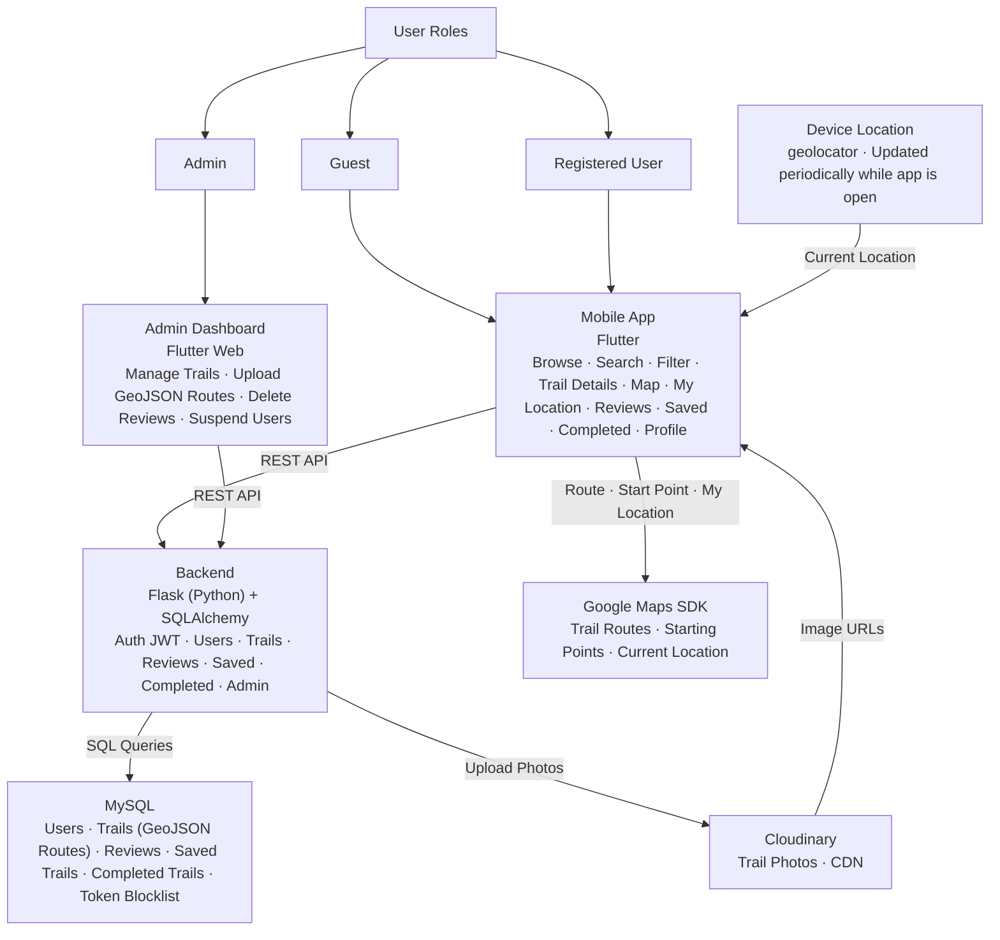

# 1. System Architecture

## Overview

This document defines the high-level system architecture for **Qimmah (قمة)**, a mobile application for discovering officially approved hiking trails across Saudi Arabia.

The architecture follows a standard 3-tier model — Frontend, Backend, and Database — with integration to external third-party services for maps and image hosting.

## Architecture Diagram

## Component Descriptions

| Component       | Technology            | Role                                                                                                                                                                                                                  |
| --------------- | --------------------- | --------------------------------------------------------------------------------------------------------------------------------------------------------------------------------------------------------------------- |
| Mobile App      | Flutter               | Renders the hiker-facing interface in Arabic (right-to-left). Handles browsing, search and filters, the trails map, trail details, saving trails, and reviews. Communicates with the backend via REST API calls.      |
| Admin Dashboard | Flutter (Web)         | Lets the admin add, edit, and deactivate trails, upload trail photos and GeoJSON route files, and moderate reviews. Uses the same backend API with admin-only routes.                                                 |
| Backend         | Flask (Python)        | Processes all business logic: authentication, data validation, filtering, rating calculation, and communication between the frontend and the database. Exposes RESTful API endpoints organized into Flask Blueprints. |
| ORM             | SQLAlchemy            | Maps Python classes to MySQL tables and builds safe, parameterized SQL queries.                                                                                                                                       |
| Database        | MySQL                 | Stores all application data: users, trails, reviews, and saved trails. Uses relational tables with foreign key constraints to enforce data integrity, and the utf8mb4 character set for Arabic text.                  |
| Route Data      | GeoJSON               | Stores each trail's route as a LineString with start and end Points, saved in a MySQL JSON column.                                                                                                                    |
| Auth Layer      | JWT (JSON Web Tokens) | Manages stateless authentication. Issues tokens on login, verifies identity on protected routes. Supports 3 roles: Visitor, Registered User, Admin.                                                                   |
| Image Storage   | Cloudinary            | Stores and serves trail photos. Provides CDN delivery and automatic optimization.                                                                                                                                     |
| Map Service     | Google Maps SDK       | Displays the trails map with markers and draws each trail's GeoJSON route between its start and end points.                                                                                                           |

## Data Flow

Steps describing how data moves through the system, covering the three key use cases defined in the sequence diagrams (Task 3):

### Use Case 1: User Login

| # | Step                                                                                                  |
| - | ----------------------------------------------------------------------------------------------------- |
| 1 | The user enters their email and password in the Flutter app.                                          |
| 2 | The app sends a login request to the Backend (Flask) over HTTPS.                                      |
| 3 | The backend checks the user's credentials against MySQL.                                              |
| 4 | MySQL returns the matching user record to the backend.                                                |
| 5 | The backend verifies the password hash and returns an authentication response (JWT token) to the app. |
| 6 | The app stores the token securely and displays a login success or error message to the user.          |

### Use Case 2: Filter Trails and View Trail Details

| # | Step                                                                                                        |
| - | ----------------------------------------------------------------------------------------------------------- |
| 1 | The user selects a region, difficulty level, and sort option in the app.                                    |
| 2 | The app requests the filtered trails from the Backend.                                                      |
| 3 | The backend queries MySQL for active trails matching the filters.                                           |
| 4 | The backend sends a trails summary list to the app as a JSON response, and the app renders the trail cards. |
| 5 | When the user taps a trail, the app requests its details from the Backend.                                  |
| 6 | The backend returns the trail data, its GeoJSON route, reviews, and rating summary.                         |
| 7 | The app passes the route coordinates to Google Maps SDK, which draws the route on the map.                  |
| 8 | Trail photos are fetched directly from Cloudinary via CDN URLs.                                             |

### Use Case 3: Add a Review

| # | Step                                                                                                           |
| - | -------------------------------------------------------------------------------------------------------------- |
| 1 | The user taps "Add your review" on the trail details screen.                                                   |
| 2 | If the user is not logged in, the app asks them to log in first.                                               |
| 3 | The logged-in user selects a rating (1–5), writes a comment, and the app sends it to the Backend with the JWT. |
| 4 | The backend verifies the token and validates the input.                                                        |
| 5 | The backend saves the review in MySQL and updates the trail's average rating.                                  |
| 6 | The backend confirms the review to the app, which displays it on the trail page.                               |

## Deployment Architecture

| Environment | Description                                                                                                                                                                                       |
| ----------- | ------------------------------------------------------------------------------------------------------------------------------------------------------------------------------------------------- |
| Development | Local machines — each developer runs the Flask API and MySQL locally, and runs the Flutter app on an emulator or device.                                                                          |
| Staging     | Pre-production environment used for testing before release.                                                                                                                                       |
| Production  | Deployed on a cloud platform (e.g., Render or Railway for the backend and MySQL). The mobile app is distributed as an APK / test build, and the admin dashboard is deployed as a Flutter web app. |

## Technical Justifications

Every technology in this architecture was chosen based on the team's functional requirements, non-functional requirements, and project constraints.

| Technology      | Decision           | Justification                                                                                                                                                                                                                                                                                                                                                                                                                                                                                                                                                                               |
| --------------- | ------------------ | ------------------------------------------------------------------------------------------------------------------------------------------------------------------------------------------------------------------------------------------------------------------------------------------------------------------------------------------------------------------------------------------------------------------------------------------------------------------------------------------------------------------------------------------------------------------------------------------- |
| Flutter         | Frontend Framework | One codebase builds the Android and iOS app and the web admin dashboard, which suits a small student team. Flutter supports right-to-left layouts for an Arabic-first interface and has an official Google Maps package.                                                                                                                                                                                                                                                                                                                                                                    |
| Flask (Python)  | Backend Framework  | Builds on the team's Python foundation from the Holberton program. Flask is lightweight and well-suited for building RESTful APIs quickly.                                                                                                                                                                                                                                                                                                                                                                                                                                                  |
| MySQL           | Database           | A relational database was chosen over a non-relational one for Qimmah's core data model.  MySQL (relational — interconnected tables) enforces strong relationships between users, trails, reviews, and saved trails, and guarantees data integrity (e.g., a review cannot exist without a valid user and trail). Foreign key constraints prevent orphaned or invalid records.  MongoDB (non-relational — JSON documents) was considered but not selected, as it does not enforce relational integrity by default. MySQL's JSON column type still allows storing GeoJSON routes. |
| GeoJSON         | Route Data Format  | An open standard for geographic data. Routes recorded with GPS tools can be uploaded as files and sent to the app without conversion.                                                                                                                                                                                                                                                                                                                                                                                                                                                       |
| JWT             | Authentication     | Stateless authentication eliminates the need for session management on the server. JWT tokens support role-based access control for 3 user types: Visitor, Registered User, Admin.                                                                                                                                                                                                                                                                                                                                                                                                          |
| Google Maps SDK | Map Service        | The map is a core feature of Qimmah. Google Maps provides reliable coverage of Saudi Arabia, custom markers, and route drawing, with an official Flutter package.                                                                                                                                                                                                                                                                                                                                                                                                                           |
| Cloudinary      | Image Hosting      | Provides a free-tier CDN for image storage and delivery, with no credit card required. Eliminates the need to manage file storage infrastructure. Supports automatic image optimization and resizing — essential for large trail photos on mobile.                                                                                                                                                                                                                                                                                                                                          |

## Non-Functional Requirements Addressed

| Requirement     | How the Architecture Addresses It                                                                                                                                                                         |
| --------------- | --------------------------------------------------------------------------------------------------------------------------------------------------------------------------------------------------------- |
| Performance     | Flutter compiles to native code for smooth scrolling and map interaction. Trail lists return summaries only, and full GeoJSON routes load on the details screen. Cloudinary CDN reduces image load times. |
| Scalability     | MySQL supports indexing and read replicas. The stateless JWT backend allows adding more Flask instances as usage grows.                                                                                   |
| Security        | JWT ensures only authenticated users access protected routes. HTTPS encrypts all client-server communication. Passwords are hashed using Werkzeug, and SQLAlchemy prevents SQL injection.                 |
| Maintainability | Separation of concerns: frontend, backend, and database are fully decoupled. Each layer can be updated independently.                                                                                     |
| Usability       | Arabic-first, right-to-left interface with simple navigation. Guests can browse all trails without an account.                                                                                            |
