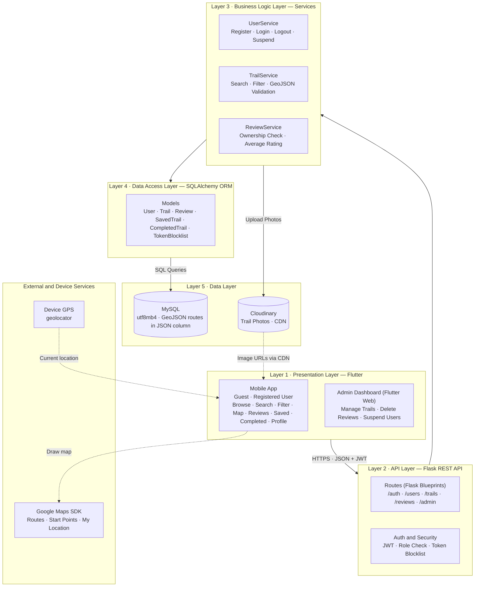

# 4. API Specifications

## External APIs

| API | Used By | Purpose | Why It Was Chosen |
|---|---|---|---|
| Google Maps SDK for Android / iOS (via `google_maps_flutter`) | Flutter mobile app | Displays trails on the map, draws each trail's GeoJSON route with its starting point, and shows the user's current location (My Location layer). | Reliable map coverage of Saudi Arabia, custom markers, route lines, and a built-in current-location layer. Has an official Flutter package, and its monthly free usage covers the MVP. |
| Google Maps JavaScript API (via `google_maps_flutter_web`) | Admin dashboard (Flutter Web) | Previews an uploaded GeoJSON route on the map before the admin saves a trail. | Same map provider as the mobile app, so routes look the same in both. |
| Cloudinary Upload API (via `cloudinary` Python SDK) | Flask backend | Uploads trail photos and returns their URLs. Photos are served to the app via Cloudinary's CDN. | Free plan with no credit card required. Images are not lost when the server redeploys. Automatic resizing and CDN delivery make photos load fast on mobile. |

> **Device services (not external APIs):** the user's current location is read on the device with the `geolocator` Flutter package, only with the user's permission and only while the app is open. It is never sent to the server.
>
> **API keys** are never shared publicly: the Google Maps key is restricted to Qimmah's app, and Cloudinary keys are stored only on the server as environment variables.

## Internal API (Flask REST API)

### General Rules

- **Base URL:** `/api`
- **Format:** All requests and responses use JSON, except admin trail uploads, which use `multipart/form-data` (to send files).
- **Authentication:** Protected endpoints require a JWT in the header: `Authorization: Bearer <token>`
- **Access levels:** 🌐 Guest (no account) · 🔒 Registered user · 🛠️ Admin only
- **Error format:** `{ "error": "Error message" }`

### Endpoints Overview

| # | Method | URL Path | Access | Description | User Story |
|---|---|---|---|---|---|
| 1 | POST | `/api/auth/register` | 🌐 | Create a new account | 1 |
| 2 | POST | `/api/auth/login` | 🌐 | Log in and receive a JWT | 2 |
| 3 | POST | `/api/auth/logout` | 🔒 | Log out and revoke the token | 2 |
| 4 | GET | `/api/users/me` | 🔒 | Get the user's account information | 17 |
| 5 | PUT | `/api/users/me` | 🔒 | Edit account information | 17 |
| 6 | GET | `/api/trails` | 🌐 | List trails with filters and search | 3, 4, 5, 8 |
| 7 | GET | `/api/trails/{id}` | 🌐 | Get trail details, GeoJSON route, starting point, and safety tips | 6, 7, 18, 22 |
| 8 | GET | `/api/trails/{id}/reviews` | 🌐 | List a trail's reviews | 9 |
| 9 | POST | `/api/trails/{id}/reviews` | 🔒 | Rate and review a trail | 12 |
| 10 | PUT | `/api/reviews/{id}` | 🔒 | Edit own review | 13 |
| 11 | DELETE | `/api/reviews/{id}` | 🔒 / 🛠️ | Delete own review, or any review (admin) | 13, 15 |
| 12 | GET | `/api/users/me/saved-trails` | 🔒 | List saved trails | 11 |
| 13 | POST | `/api/users/me/saved-trails` | 🔒 | Save a trail | 11 |
| 14 | DELETE | `/api/users/me/saved-trails/{trail_id}` | 🔒 | Remove a saved trail | 11 |
| 15 | GET | `/api/users/me/completed-trails` | 🔒 | List completed trails | 16 |
| 16 | POST | `/api/users/me/completed-trails` | 🔒 | Mark a trail as completed | 16 |
| 17 | DELETE | `/api/users/me/completed-trails/{trail_id}` | 🔒 | Unmark a completed trail | 16 |
| 18 | POST | `/api/admin/trails` | 🛠️ | Add a new trail | 14 |
| 19 | PUT | `/api/admin/trails/{id}` | 🛠️ | Edit a trail | 14 |
| 20 | DELETE | `/api/admin/trails/{id}` | 🛠️ | Delete a trail | 14 |
| 21 | GET | `/api/admin/reviews` | 🛠️ | List all reviews for moderation | 15 |
| 22 | GET | `/api/admin/users` | 🛠️ | List users | 21 |
| 23 | PATCH | `/api/admin/users/{id}/status` | 🛠️ | Suspend or reactivate a user | 21 |

> **Handled in the app, not the API:**
> - **Story 10 (guest sign-up prompt):** the app shows the prompt when a guest tries an action that needs a 🔒 endpoint.
> - **Story 19 (share a trail):** the app shares the trail's link through the device's share menu (`share_plus`).
> - **Story 20 (switch language):** the app switches its interface with Flutter localization.
> - **Story 22 (current location):** the app reads the location on the device and draws it on the map over the route from endpoint 7.

---

### Auth

#### 1. POST `/api/auth/register` 🌐

**Input (JSON):**
```json
{
  "name": "Sara",
  "email": "sara@example.com",
  "password": "StrongPass123"
}
```

**Output — 201 Created:**
```json
{
  "token": "eyJhbGciOiJIUzI1NiIs...",
  "user": { "id": 12, "name": "Sara", "email": "sara@example.com", "role": "user" }
}
```

**Errors:** `400` missing or invalid fields · `409` email already registered

#### 2. POST `/api/auth/login` 🌐

**Input (JSON):**
```json
{
  "email": "sara@example.com",
  "password": "StrongPass123"
}
```

**Output — 200 OK:** Same structure as register.

**Errors:** `401` invalid email or password · `403` account suspended

#### 3. POST `/api/auth/logout` 🔒

**Input:** JWT in header only.

**Output — 200 OK:**
```json
{ "message": "Logged out successfully" }
```

> The token is added to a blocklist on the server so it can no longer be used, and the app deletes it from secure storage.

---

### User Account

#### 4. GET `/api/users/me` 🔒

**Output — 200 OK:**
```json
{
  "id": 12,
  "name": "Sara",
  "email": "sara@example.com",
  "role": "user",
  "saved_trails_count": 4,
  "completed_trails_count": 2,
  "reviews_count": 3
}
```

#### 5. PUT `/api/users/me` 🔒

**Input (JSON):** only the fields being changed. Changing the password requires the current password.
```json
{
  "name": "Sara A.",
  "current_password": "StrongPass123",
  "new_password": "NewStrongPass456"
}
```

**Output — 200 OK:** The updated user object.

**Errors:** `400` invalid fields · `401` wrong current password · `409` email already used

---

### Trails

#### 6. GET `/api/trails` 🌐

**Input (query parameters, all optional):**

| Parameter | Type | Example | Description |
|---|---|---|---|
| `region` | string | `asir` | Filter by region |
| `difficulty` | string | `easy` · `moderate` · `hard` | Filter by difficulty |
| `search` | string | `السودة` | Search by trail name |
| `page` | integer | `1` | Page number |
| `limit` | integer | `20` | Results per page |

**Example:** `GET /api/trails?region=asir&difficulty=moderate`

**Output — 200 OK** (short summary only, no full route):
```json
{
  "trails": [
    {
      "id": 7,
      "name": "مسار جبل السودة",
      "region": "asir",
      "difficulty": "moderate",
      "distance_km": 8,
      "duration": "3–4 ساعات",
      "avg_rating": 4.8,
      "reviews_count": 125,
      "cover_image": "https://res.cloudinary.com/.../soudah.jpg",
      "start_point": { "lat": 18.2721, "lng": 42.3684 }
    }
  ],
  "page": 1,
  "total": 1
}
```

#### 7. GET `/api/trails/{id}` 🌐

**Input:** Trail ID in the URL path.

**Output — 200 OK:**
```json
{
  "id": 7,
  "name": "مسار جبل السودة",
  "region": "asir",
  "difficulty": "moderate",
  "distance_km": 8,
  "duration": "3–4 ساعات",
  "description": "مسار جبلي يتميز بإطلالاته الطبيعية...",
  "safety_tips": ["احمل كمية كافية من الماء", "ارتدِ حذاءً مناسبًا للمشي"],
  "images": [
    "https://res.cloudinary.com/.../soudah-1.jpg",
    "https://res.cloudinary.com/.../soudah-2.jpg"
  ],
  "start_point": { "lat": 18.2721, "lng": 42.3684 },
  "route_geojson": {
    "type": "FeatureCollection",
    "features": [
      {
        "type": "Feature",
        "properties": { "name": "route" },
        "geometry": {
          "type": "LineString",
          "coordinates": [[42.3684, 18.2721], [42.3701, 18.2745], [42.3730, 18.2790]]
        }
      },
      {
        "type": "Feature",
        "properties": { "name": "start" },
        "geometry": { "type": "Point", "coordinates": [42.3684, 18.2721] }
      }
    ]
  },
  "avg_rating": 4.8,
  "reviews_count": 125,
  "share_url": "https://qimmah.app/trails/7",
  "is_saved": false,
  "is_completed": false
}
```

> GeoJSON coordinates are in `[longitude, latitude]` order. `is_saved` and `is_completed` are returned only when a valid JWT is sent. The app draws `route_geojson` on the map and shows the user's current location over it (story 22).

**Errors:** `404` trail not found

---

### Reviews

#### 8. GET `/api/trails/{id}/reviews` 🌐

**Input:** Trail ID in the path · optional query `page`, `limit`.

**Output — 200 OK:**
```json
{
  "reviews": [
    {
      "id": 31,
      "user": { "id": 12, "name": "Sara" },
      "rating": 5,
      "comment": "مسار رائع وإطلالات جميلة",
      "created_at": "2026-10-01T09:30:00Z",
      "updated_at": null
    }
  ],
  "page": 1,
  "total": 125
}
```

#### 9. POST `/api/trails/{id}/reviews` 🔒

**Input (JSON):**
```json
{
  "rating": 5,
  "comment": "مسار رائع وإطلالات جميلة"
}
```

**Output — 201 Created:**
```json
{
  "id": 31,
  "trail_id": 7,
  "rating": 5,
  "comment": "مسار رائع وإطلالات جميلة",
  "created_at": "2026-10-01T09:30:00Z",
  "trail_avg_rating": 4.8
}
```

**Errors:** `400` rating not 1–5 or empty comment · `401` not logged in · `404` trail not found · `409` already reviewed this trail

#### 10. PUT `/api/reviews/{id}` 🔒

**Input (JSON):** the fields being changed.
```json
{
  "rating": 4,
  "comment": "مسار جميل لكنه مزدحم في الإجازات"
}
```

**Output — 200 OK:** The updated review, with the trail's new average rating.

**Errors:** `400` invalid input · `403` not the review's owner · `404` review not found

#### 11. DELETE `/api/reviews/{id}` 🔒 / 🛠️

**Output — 204 No Content**

> A user can delete only their own reviews; an admin can delete any review. The trail's average rating is recalculated after deletion.

**Errors:** `403` not the owner and not an admin · `404` review not found

---

### Saved Trails

#### 12. GET `/api/users/me/saved-trails` 🔒

**Output — 200 OK:** a list of trails in the same summary structure as endpoint 6.

#### 13. POST `/api/users/me/saved-trails` 🔒

**Input (JSON):**
```json
{ "trail_id": 7 }
```

**Output — 201 Created:**
```json
{ "message": "Trail saved", "trail_id": 7 }
```

**Errors:** `404` trail not found · `409` already saved

#### 14. DELETE `/api/users/me/saved-trails/{trail_id}` 🔒

**Output — 204 No Content**

**Errors:** `404` trail not in saved list

---

### Completed Trails

#### 15. GET `/api/users/me/completed-trails` 🔒

**Output — 200 OK:** a list of trails in the same summary structure as endpoint 6, each with a `completed_at` date.

#### 16. POST `/api/users/me/completed-trails` 🔒

**Input (JSON):**
```json
{ "trail_id": 7 }
```

**Output — 201 Created:**
```json
{ "message": "Trail marked as completed", "trail_id": 7, "completed_at": "2026-10-01T15:00:00Z" }
```

**Errors:** `404` trail not found · `409` already marked as completed

#### 17. DELETE `/api/users/me/completed-trails/{trail_id}` 🔒

**Output — 204 No Content**

---

### Admin

#### 18. POST `/api/admin/trails` 🛠️

**Input (`multipart/form-data`):**

| Field | Type | Required | Description |
|---|---|---|---|
| `name` | text | ✅ | Trail name |
| `region` | text | ✅ | Region code |
| `difficulty` | text | ✅ | `easy` · `moderate` · `hard` |
| `distance_km` | number | ✅ | Distance in km |
| `duration` | text | ✅ | Estimated duration |
| `description` | text | ✅ | Trail description |
| `safety_tips` | text (JSON array) | ❌ | Safety tips |
| `route_file` | file (.geojson) | ✅ | Route as a LineString, with the starting point as a Point |
| `images` | file(s) | ✅ | Trail photos (uploaded to Cloudinary) |

**Output — 201 Created:**
```json
{
  "id": 8,
  "name": "مسار وادي لجب",
  "images": ["https://res.cloudinary.com/.../lajab-1.jpg"],
  "message": "Trail created"
}
```

**Errors:** `400` invalid data or GeoJSON · `401` not logged in · `403` not an admin

#### 19. PUT `/api/admin/trails/{id}` 🛠️

**Input (`multipart/form-data`):** same fields as endpoint 18; only the changed fields are sent.

**Output — 200 OK:** The updated trail object.

**Errors:** `400` · `401` · `403` · `404` trail not found

#### 20. DELETE `/api/admin/trails/{id}` 🛠️

**Output — 204 No Content**

> Deleting a trail also deletes its reviews, saved entries, and completed entries, and removes its photos from Cloudinary.

#### 21. GET `/api/admin/reviews` 🛠️

**Input (query, optional):** `trail_id`, `page`, `limit`

**Output — 200 OK:**
```json
{
  "reviews": [
    {
      "id": 31,
      "trail": { "id": 7, "name": "مسار جبل السودة" },
      "user": { "id": 12, "name": "Sara" },
      "rating": 5,
      "comment": "مسار رائع وإطلالات جميلة",
      "created_at": "2026-10-01T09:30:00Z"
    }
  ],
  "page": 1,
  "total": 340
}
```

> To delete a review, the admin uses endpoint 11.

#### 22. GET `/api/admin/users` 🛠️

**Input (query, optional):** `search`, `page`, `limit`

**Output — 200 OK:**
```json
{
  "users": [
    { "id": 12, "name": "Sara", "email": "sara@example.com", "reviews_count": 3, "is_suspended": false }
  ],
  "page": 1,
  "total": 1
}
```

#### 23. PATCH `/api/admin/users/{id}/status` 🛠️

**Input (JSON):**
```json
{ "is_suspended": true }
```

**Output — 200 OK:**
```json
{ "id": 12, "is_suspended": true }
```

> A suspended user cannot log in, and their existing tokens are rejected.

**Errors:** `403` not an admin · `404` user not found

---

### HTTP Status Codes Used

| Code | Meaning |
|---|---|
| 200 OK | Request succeeded |
| 201 Created | New resource created |
| 204 No Content | Deleted successfully, no body |
| 400 Bad Request | Invalid input |
| 401 Unauthorized | Missing, invalid, or expired token |
| 403 Forbidden | Not allowed (not the owner, not an admin, or account suspended) |
| 404 Not Found | Resource not found |
| 409 Conflict | Duplicate (email exists, or trail already saved, completed, or reviewed) |


# 1. System Architecture

## Overview

This document defines the high-level system architecture for **Qimmah (قمة)**, a mobile application for discovering hiking trails across Saudi Arabia.

Qimmah follows a **layered architecture**: the system is divided into five layers, and each layer communicates only with the layer directly below it. This separates the user interface, request handling, business rules, data access, and storage, so each part can be built, tested, and changed independently. The system supports three user roles: **Guest**, **Registered User**, and **Admin**.

## Architecture Diagram



> Solid arrows show the main request path through the layers. Dashed arrows show services the app uses directly, without going through the backend.

## Layer Descriptions

### Layer 1 · Presentation Layer

| Component | Technology | Role |
|---|---|---|
| Mobile App | Flutter | Renders the user interface in Arabic and English. Handles browsing, searching, filtering, trail details, the trail map with the user's current location, reviews, saved and completed trails, and the user profile. Shows a sign-up prompt when a guest tries to save, rate, or review. |
| Admin Dashboard | Flutter (Web) | Lets the admin add, edit, and delete trails, upload trail photos and GeoJSON route files, delete inappropriate reviews, and suspend users. |
| Localization | flutter_localizations | Switches the interface between Arabic (right-to-left) and English. |
| Sharing | share_plus | Shares a trail link through the device's share menu. |
| Token Storage | flutter_secure_storage | Stores the JWT securely on the device. |

### Layer 2 · API Layer

| Component | Technology | Role |
|---|---|---|
| Routes | Flask Blueprints | Receives HTTP requests and returns JSON responses. Organized into modules: Auth, Users, Trails, Reviews, and Admin. |
| Auth and Security | Flask-JWT-Extended | Verifies the JWT on protected routes, checks the user's role for admin routes, and rejects revoked tokens (token blocklist) and suspended accounts. |

### Layer 3 · Business Logic Layer

| Component | Role |
|---|---|
| UserService | Handles registration, login, password hashing (Werkzeug), logout, profile updates, and suspending users. |
| TrailService | Handles trail search and filtering, adding, editing, and deleting trails, GeoJSON route validation, and photo uploads to Cloudinary. |
| ReviewService | Handles adding, editing, and deleting reviews, checks review ownership, prevents duplicate reviews, and recalculates each trail's average rating. |

### Layer 4 · Data Access Layer

| Component | Technology | Role |
|---|---|---|
| Models | SQLAlchemy ORM | Maps Python classes (User, Trail, Review, SavedTrail, CompletedTrail, TokenBlocklist) to MySQL tables, and builds safe, parameterized SQL queries. |

### Layer 5 · Data Layer

| Component | Technology | Role |
|---|---|---|
| Database | MySQL | Stores users, trails, reviews, saved trails, completed trails, and revoked tokens. Uses foreign key constraints for data integrity and utf8mb4 for Arabic text. Each trail's route is stored as GeoJSON in a JSON column. |
| Image Storage | Cloudinary | Stores trail photos and delivers them to the app via CDN with automatic optimization. |

### External and Device Services

| Component | Technology | Role |
|---|---|---|
| Map Service | Google Maps SDK | Displays trails on the map, draws each trail's route with its starting point, and shows the user's current location. |
| Device Location | geolocator | Reads the user's location with their permission, updating it periodically while the app is open. The location stays on the device and is never sent to the server. |

## Data Flow Through the Layers

Steps describing how data moves through the layers, covering the key use cases defined in the sequence diagrams (Task 3).

### Use Case 1: User Login

| # | Layer | Step |
|---|---|---|
| 1 | Presentation | The user enters their email and password, and the app sends a login request over HTTPS. |
| 2 | API | The Auth route receives the request and passes it to UserService. |
| 3 | Business Logic | UserService asks the data access layer for the user with this email. |
| 4 | Data Access → Data | The User model queries MySQL and returns the user record. |
| 5 | Business Logic | UserService verifies the password hash and checks that the account is not suspended. |
| 6 | API | The Auth route generates a JWT and returns it to the app. |
| 7 | Presentation | The app stores the token securely and opens the Home screen, or shows an error message. |

### Use Case 2: Browse, Search, and Filter Trails

| # | Layer | Step |
|---|---|---|
| 1 | Presentation | The user (guest or registered) selects a region and difficulty, or searches by name. |
| 2 | API | The Trails route receives the request (no token needed) and passes the filters to TrailService. |
| 3 | Business Logic | TrailService builds the search and filter criteria. |
| 4 | Data Access → Data | The Trail model queries MySQL for matching trails. |
| 5 | API | The route returns a short summary of each trail as JSON. |
| 6 | Presentation | The app renders the trail cards, loading photos directly from Cloudinary via CDN. |

### Use Case 3: View Trail Details and Current Location

| # | Layer | Step |
|---|---|---|
| 1 | Presentation | The user taps a trail, and the app requests its details. |
| 2 | API → Business Logic | The Trails route passes the request to TrailService. |
| 3 | Data Access → Data | The Trail model gets the trail data and GeoJSON route from MySQL. |
| 4 | API | The route returns the trail details, route, starting point, and safety tips as JSON. |
| 5 | Presentation + External | The app passes the route and starting point to Google Maps SDK, which draws them on the map. |
| 6 | Presentation + Device | If the user allows location access, the app reads their location from the device GPS and updates it on the map periodically while the app is open. |

### Use Case 4: Rate and Review a Trail

| # | Layer | Step |
|---|---|---|
| 1 | Presentation | The user taps "Add your review". If the user is a guest, the app prompts them to sign up. |
| 2 | Presentation | The registered user selects a rating (1–5), writes a comment, and the app sends it with the JWT. |
| 3 | API | Auth and Security verifies the token, and the Reviews route passes the review to ReviewService. |
| 4 | Business Logic | ReviewService validates the rating and checks that the user has not already reviewed this trail. |
| 5 | Data Access → Data | The Review model saves the review in MySQL, and the trail's average rating is updated. |
| 6 | API → Presentation | The route returns the new review, and the app displays it on the trail page. |

## Deployment Architecture

| Environment | Description |
|---|---|
| Development | Local machines — each developer runs the Flask API and MySQL locally, and runs the Flutter app on an emulator or device. |
| Staging | Pre-production environment used for testing before release. |
| Production | Deployed on a cloud platform (e.g., Render or Railway for the backend and MySQL). The mobile app is distributed as an APK / test build, and the admin dashboard is deployed as a Flutter web app. Secret keys are kept in environment variables on the server. |

## Technical Justifications

Every technology and design decision in this architecture was chosen based on the team's functional requirements, non-functional requirements, and project constraints.

| Decision | Justification |
|---|---|
| **Layered Architecture** | Separating the system into layers gives each part one clear responsibility. The team can work on different layers in parallel, test business rules without the interface or database, and change one layer (e.g., the database) without rewriting the others. |
| **Flutter** (Presentation) | One codebase builds the Android and iOS app and the web admin dashboard, which suits a small student team. Flutter supports both right-to-left (Arabic) and left-to-right (English) layouts, and has official packages for Google Maps and localization. |
| **Flask** (API + Business Logic) | Builds on the team's Python foundation from the Holberton program. Flask is lightweight and well-suited for building RESTful APIs quickly, and Blueprints keep each module independent. |
| **SQLAlchemy** (Data Access) | Lets the team work with Python classes instead of raw SQL, and uses parameterized queries that protect against SQL injection. |
| **MySQL** (Data) | A relational database enforces strong relationships between users, trails, reviews, saved trails, and completed trails, and guarantees data integrity (e.g., a review cannot exist without a valid user and trail). MongoDB was considered but not selected, as it does not enforce relational integrity by default. MySQL's JSON column type still stores GeoJSON routes. |
| **GeoJSON** | An open standard for geographic data. Routes recorded with GPS tools can be uploaded as files and drawn on the map without conversion, letting hikers compare their location with the route. |
| **JWT** | Stateless authentication supports role-based access for Guest, Registered User, and Admin. A token blocklist makes logout secure. |
| **Google Maps SDK** | Reliable map coverage of Saudi Arabia, route lines, and a built-in current-location layer, with an official Flutter package. |
| **geolocator** | Reads the device location on Android and iOS with permission handling. Updating only while the app is open keeps the feature simple and saves battery. |
| **Cloudinary** | Free-tier CDN with no credit card required. Images are not lost when the server redeploys, and photos are optimized automatically for mobile. |

## Non-Functional Requirements Addressed

| Requirement | How the Architecture Addresses It |
|---|---|
| Performance | Flutter compiles to native code for smooth scrolling and map interaction. Trail lists return short summaries, and full GeoJSON routes
