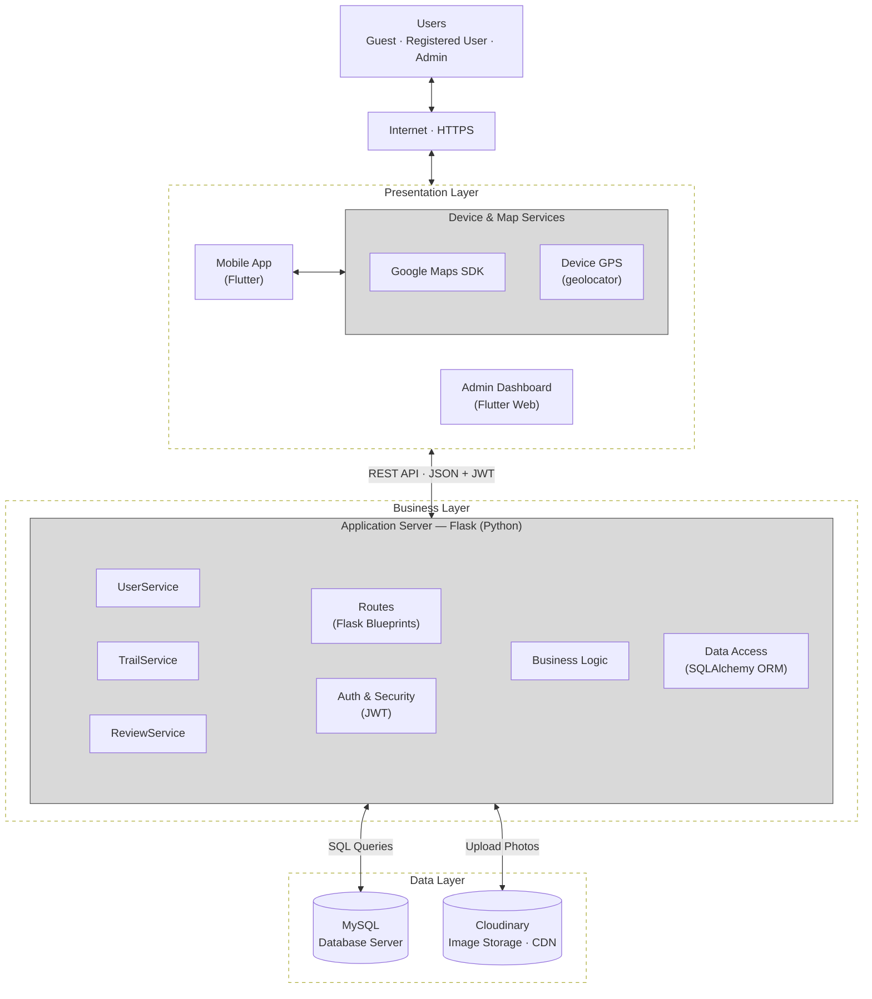

```mermaid
flowchart TB
    CLIENT["Users<br/>Guest · Registered User · Admin"]
    NET["Internet · HTTPS"]

    subgraph PL["Presentation Layer"]
        direction LR
        APP["Mobile App<br/>(Flutter)"]
        ADMIN["Admin Dashboard<br/>(Flutter Web)"]
        subgraph DEV["Device & Map Services"]
            direction TB
            MAPS["Google Maps SDK"]
            GPS["Device GPS<br/>(geolocator)"]
        end
    end

    subgraph BL["Business Layer"]
        subgraph AS["Application Server — Flask (Python)"]
            direction TB
            subgraph R1[" "]
                direction LR
                ROUTES["Routes<br/>(Flask Blueprints)"]
                AUTH["Auth & Security<br/>(JWT)"]
            end
            LOGIC["Business Logic"]
            subgraph R2[" "]
                direction LR
                US["UserService"]
                TS["TrailService"]
                RS["ReviewService"]
            end
            DA["Data Access<br/>(SQLAlchemy ORM)"]
        end
    end

    subgraph DL["Data Layer"]
        direction LR
        DB[("MySQL<br/>Database Server")]
        CLOUD[("Cloudinary<br/>Image Storage · CDN")]
    end

    CLIENT <--> NET
    NET <--> PL
    APP <--> DEV
    PL <-->|REST API · JSON + JWT| AS
    AS <-->|SQL Queries| DB
    AS <-->|Upload Photos| CLOUD

    style PL fill:none,stroke-dasharray: 5 5
    style BL fill:none,stroke-dasharray: 5 5
    style DL fill:none,stroke-dasharray: 5 5
    style AS fill:#d9d9d9,stroke:#555
    style DEV fill:#d9d9d9,stroke:#555
    style R1 fill:none,stroke:none
    style R2 fill:none,stroke:none
```
